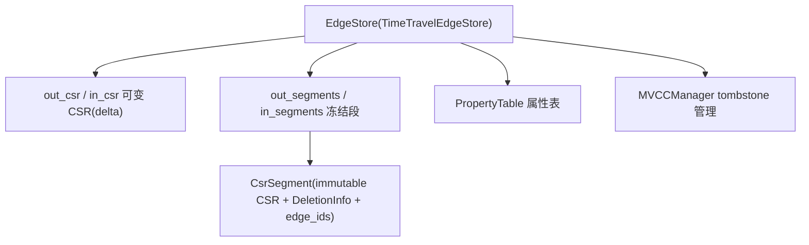
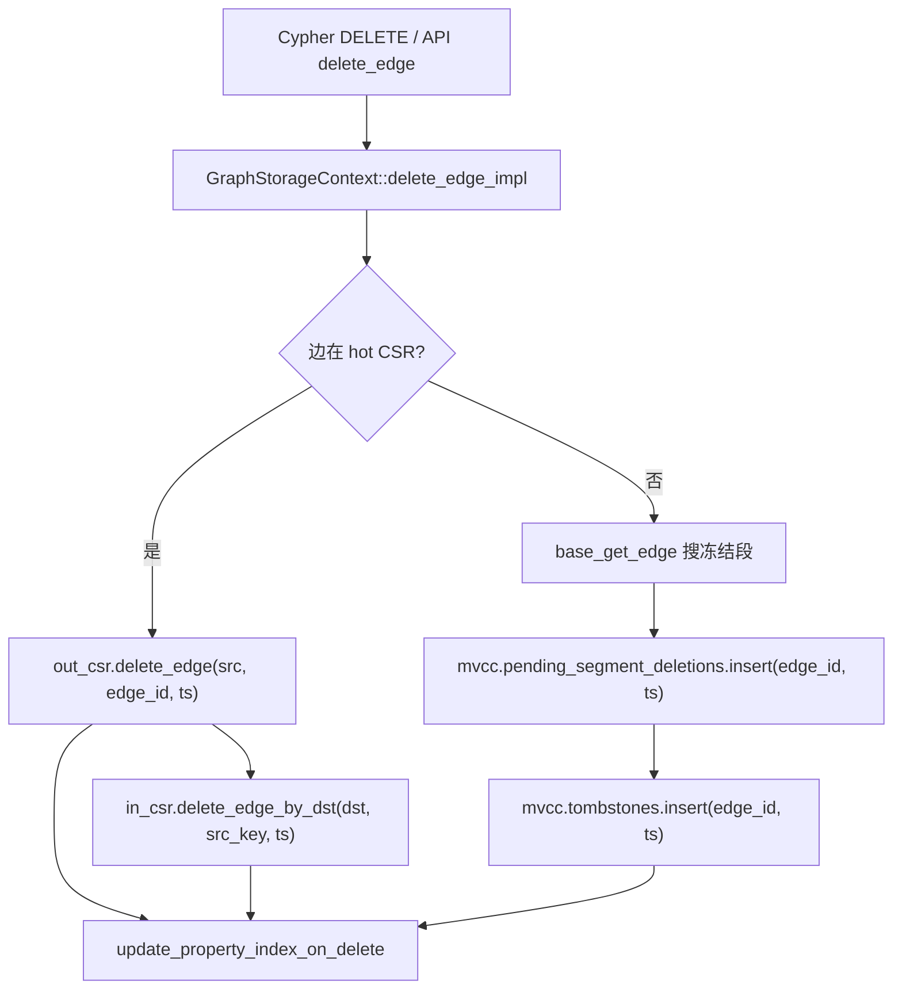
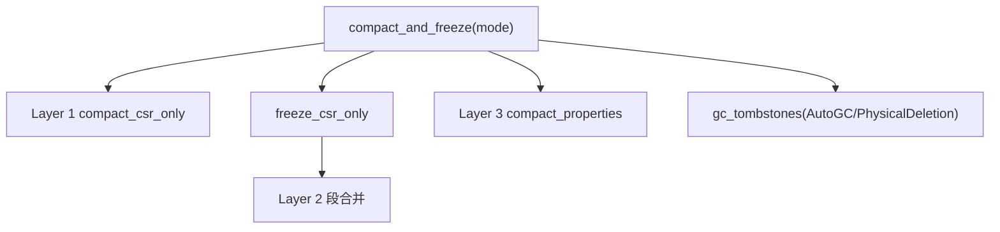
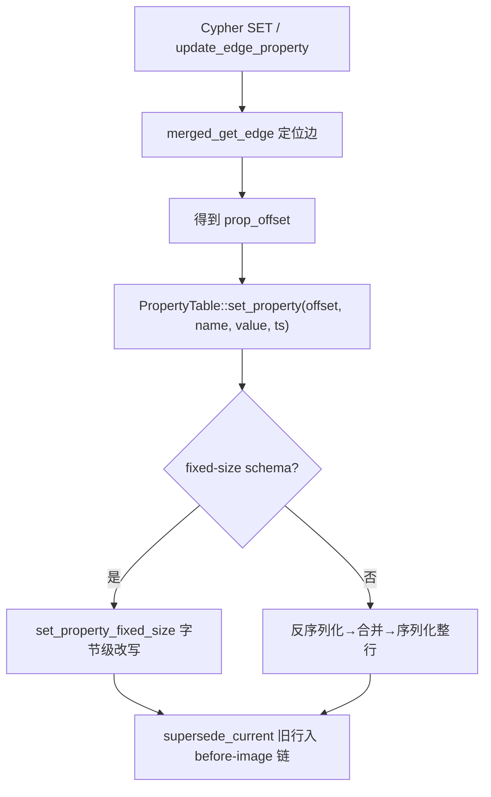

# linkrs 与 ladybug 边更新/删除逻辑对比分析

> 分析对象：
>
> - linkrs（GraphDB）：https://github.com/kkkqkx123/linkrs ，Rust 单节点图数据库，commit `master`
> - ladybug（原 Kuzu）：https://github.com/LadybugDB/ladybug ，C++ 嵌入式图数据库
>
> 分析方法：源码静态走查，聚焦"边的删除（DELETE）与更新（SET 属性）"的完整调用链、MVCC 语义、物理回收与 WAL 记录。
>
> 生成日期：2026-08-18

---

## 1. 项目概览

| 维度 | linkrs（GraphDB） | ladybug（原 Kuzu） |
|------|-------------------|--------------------|
| 语言 | Rust（workspace 11 个子 crate） | C++ |
| 定位 | 轻量级单节点图数据库，本地部署 | 嵌入式图数据库，超大规模分析负载 |
| 数据模型 | Space / Tag / Edge Type（NebulaGraph 风格），rank 区分重边 | Property Graph + Cypher |
| 边存储 | 可变 CSR（delta）+ 冻结段（frozen segment）双区；属性独立 PropertyTable | FWD/BWD 双向 RelTableData，CSR 头列（offset/length）+ 数据列，持久化 CSR 区 + 内存暂存区 |
| 事务 | 时间戳（Timestamp）模型 + WriteSet 提交认证 | 事务 ID 行级版本（VersionInfo/UpdateInfo）+ Undo Buffer |
| 删除语义 | hot CSR 内嵌 `delete_ts` 标记；冻结段走全局 EdgeId tombstone HashMap | 行级 `deletedVersions` 数组打标（事务 ID） |
| 更新语义 | PropertyTable 版本链（before-image chain），CSR 不参与 | UpdateInfo 版本链（copy-on-write），主存储不原位改写 |
| 物理回收 | 三层：CSR compact → segment merge deletion filter → property compact | checkpoint 时的 CSR region 级重写 |

---

## 2. linkrs 的边更新/删除逻辑

### 2.1 边存储架构

linkrs 的边表（`TimeTravelEdgeStore`）把边分成两个存储区域，属性单独存放：



- **可变 CSR（delta）**：新写入边先进 `out_csr` / `in_csr`（`CsrVariant`，primary 数组 + overflow chunk），每条边记录为 `Nbr`：
  ```rust
  pub struct Nbr {
      pub neighbor: VertexId,
      pub edge_id: EdgeId,
      pub prop_offset: u32,   // 指向 PropertyTable 的行
      pub create_ts: Timestamp,
      pub delete_ts: Timestamp,  // MAX 表示未删除
  }
  ```
- **冻结段（frozen segment）**：delta 超过阈值（默认 100MB）或后台维护时冻结为不可变 `CsrSegment`（`ImmutableNbr`，无 delete_ts 字段，属性指针仍在）。段上带 `DeletionInfo{min_ts, max_ts, deleted_count}` 便于跳过优化。
- **PropertyTable**：行式属性记录 + per-row before-image 版本链（`chain_records`），边通过 `prop_offset` 引用。
- 同一条边在 out/in 两个方向各存一份（`Nbr::new` 双写），共享同一个 `prop_offset` 和 `edge_id`。

### 2.2 边删除（DELETE）

完整调用链：



#### (a) hot CSR 中的边：内嵌 `delete_ts` 逻辑删除

`EdgeStore::delete_edge` → `TimeTravelEdgeStore::delete_edge`（`crates/graphdb-storage/src/storage/edge/edge_table/core.rs:561`）：

- 在 `out_csr` 按 `(src, dst_key)` 定位边，`out_csr.delete_edge(src, edge_id, ts)` 把该 `Nbr.delete_ts` 从 `Timestamp::MAX` 改为 `ts`（`mutable_csr.rs:319`）；
- 反向边用 `in_csr.delete_edge_by_dst(dst, src_key, ts)` 同样打标；
- `edge_count` 递减，但 CSR 数组中的槽位**不回收**，边仍占内存；
- 可见性：`Nbr::is_valid_at(ts) = create_ts <= ts < delete_ts`（`edge.rs:261`）。

删除是**纯逻辑标记、无数据搬移**，且删除条件要求 `create_ts <= ts`（不能删除"未来"边）。

#### (b) 冻结段中的边：全局 EdgeId tombstone

若边已冻结进 segment（`base_get_edge` 命中），则**不修改 segment 内任何数据**，只向 `MVCCManager` 写两条记录：

- `pending_segment_deletions.insert(edge_id, ts)`（待并入段 tombstone 的临时层）；
- `tombstones.insert(edge_id, ts)`（通用热层）。

查询冻结段时实时过滤：`mvcc.is_tombstoned(edge_id, ts)`（`edge_table/mvcc.rs:67`）——先查热层 HashMap（pending / segment / legacy 三张表），未命中再查冷层（按 EdgeId 排序的 `Vec` + Bloom filter 预过滤 + 二分查找）。

`MVCCManager` 的快照隔离依赖 `active_snapshots` 引用计数维护 `min_active_snapshot_ts`；只有 `delete_ts < min_active_snapshot_ts` 的 tombstone 才允许 GC（`gc_tombstones_batch`）。

#### (c) 物理回收：三层模型

删除只做逻辑标记，物理空间回收由维护管线（`compact_and_freeze`，`compaction.rs:271`）按模式分三层完成：



| 层 | 操作 | 效果 | 触发 |
|----|------|------|------|
| L1 | `compact_csr_only` → `CsrVariant::compact_with_ts` | 物理移除 delta CSR 中 `delete_ts != MAX` 的 `Nbr`，重建平坦 CSR（`mutable_csr.rs:702`） | 手动/后台维护 |
| L2 | segment merge（`merge_*_with_free_space`） | 合并段时按需丢弃 tombstoned 边（仅 PhysicalDeletion 模式） | 段数超阈值（默认 50） |
| L3 | `compact_properties` | 全量扫描收集有效 `prop_offset`，回收无引用属性记录；附带 `gc_versions` 清理 before-image 链 | 维护时 |

注意：L1 的 `compact_with_ts` 只按 `delete_ts == MAX` 过滤，**与 `ts` 参数无关**——这意味着即便还有活跃快照引用，已删边也会被物理移除，快照读取将看到"删除"而非"该时间点仍存在"。时间旅行语义依赖段路径（tombstone 保留在 HashMap 中直到 GC），而 delta 路径无此保护。

#### (d) 事务回滚与 WAL

- **WAL redo**：`delete_edge_at_timestamp`（`graph_storage/writer.rs:905`）先 `append_wal_redo(WalOpType::DeleteEdge)` 写 `DeleteEdgeRedo{src_label, src_vid, dst_label, dst_vid, edge_label, rank}`（`graphdb-core/src/core/wal/redo.rs:60`），再执行删除。崩溃恢复时 `replay_delete_edge` 重放。
- **undo（回滚）**：`UndoTarget::delete_edge` 记录边标识 + out/in 偏移，回滚调 `revert_delete_edge_by_offset` → `MutableCsr::revert_delete_by_offset`（`mutable_csr.rs:415`），把 `delete_ts` 恢复为 MAX。回滚只对 `delete_ts <= ts`（早于回滚点）的删除生效。
- 段路径删除的 undo 通过 `restore_edge`（重新 `insert_edge`）实现。

### 2.3 边更新（UPDATE / SET 属性）

调用链：



关键点：

1. **CSR 不参与更新**。`Nbr` 只存 `prop_offset` 指针，属性值全在 PropertyTable；更新属性只改属性表，邻接结构零改动。这是 linkrs 与 ladybug 最大的相似点之一。
2. **属性 MVCC = before-image 版本链**。`set_property`（`property_table.rs:856`）先把当前行通过 `supersede_current`（`property_table.rs:834`）标记 `delete_ts = ts` 并**克隆进 `chain_records[row]`**（该行的历史链），再以新值覆盖当前记录。读取时 `get(offset, Some(query_ts))` 先查当前记录可见性，不可见则沿链找 `[create_ts, delete_ts)` 覆盖 query_ts 的版本。链上旧值在 `compact_properties` 的 `gc_versions(min_active_snapshot_ts)` 中清理。
3. **快路径**：固定大小 schema（数字类型等）用 `set_property_fixed_size` 直接克隆旧字节并在列偏移处改写，省去整行反序列化；慢路径整行重写。
4. **双方向一致性检查**：`update_edge_property_by_offset` 更新后校验 out/in 两个方向的 `prop_offset` 一致，不一致返回 `data_corruption`（`core.rs:1060`）。
5. **WAL/回滚**：WAL 记 `UpdateEdgePropRedo{prop_name, value, 边标识}`；回滚用 `update_edge_property_undo_single` 以旧值重新 `update_edge_property_by_offset`。

### 2.4 linkrs 边删除/更新小结

- 删除 = **双区双机制**：hot CSR 用内嵌 `delete_ts` 打标，冻结段用全局 EdgeId tombstone HashMap 打标；物理回收依赖维护管线三层模型，且 delta 层回收不感知活跃快照。
- 更新 = **CSR 不动、属性表 before-image 版本链**，支持时间旅行回看历史属性值。
- 可见性统一为时间戳区间：`create_ts <= ts < delete_ts`（delta）或 `!is_tombstoned(edge_id, ts)`（段）。

---

## 3. ladybug 的边更新/删除逻辑

### 3.1 存储架构

`RelTable` 为每个存储方向维护一个 `RelTableData`（FWD 存 src→dst 邻接，BWD 存 dst→src 邻接），同一条边两方向各存一份：

- **CSR 头列**：`csrHeaderColumns{offset, length}` 两个 UINT64 列，每个 bound node 一行（offset 即前缀和）；
- **数据列**：`columns[0]=NBR_ID`、`columns[1]=REL_ID`，其后为属性列；
- **CSRNodeGroup 双区**（`csr_node_group.h:165`）：
  - `persistentChunkGroup`（`ChunkedCSRNodeGroup`）：已 checkpoint 的 CSR 紧凑布局（ON_DISK）；
  - `chunkedGroups` + `csrIndex`：已提交但未落盘的内存行（追加式列存），`csrIndex` 把 bound node 映射到内存行号（顺序或行号列表）。

### 3.2 边删除（DELETE）

调用链：`delete_executor → RelTable::delete_`（`rel_table.cpp:270`）→ 对 FWD/BWD 各 `RelTableData::delete_` → `CSRNodeGroup::delete_` → `ChunkedNodeGroup::delete_` → `VersionInfo::delete_`。

核心设计：**删除 = per-vector 的 `deletedVersions` 数组打事务 ID 标记，列数据原位不动**。

```cpp
bool VectorVersionInfo::delete_(transaction_t txnID, row_idx_t rowIdx) {
    deletionStatus = DeletionStatus::CHECK_VERSION;
    if (transactionID == sameDeletionVersion) return false;           // 本事务重复删
    if (isSameDeletionVersion()) throw ...("Write-write conflict ..."); // 写写冲突
    ...
    if (deletedVersions->operator[](rowIdx) == transactionID) return false;
    if (deletedVersions->operator[](rowIdx) != INVALID_TRANSACTION)
        throw ...("Write-write conflict ...");
    deletedVersions->operator[](rowIdx) = transactionID;              // ← tombstone 本体
    return true;
}
```

要点：

- 每个 vector（2048 行）维护 `insertedVersions` / `deletedVersions` 两个 `std::array<transaction_t, 2048>`，配 `sameInsertionVersion/sameDeletionVersion` 整 vector 快速路径（全同事务时不分配数组）；
- **写写冲突在写入时即抛异常**（同一行被两个不同事务删除/更新），无需提交期认证；
- 未提交的新边（`relOffset >= MAX_NUM_ROWS_IN_TABLE`）走 `LocalRelTable` 本地存储，删除即从行索引 erase；
- DETACH DELETE（删节点连带删边）走 `RelTable::detachDeleteBatch`，逐条对 FWD/BWD 打标；
- WAL 记录 `RelDeletionRecord{tableID, srcNodeIDVector, dstNodeIDVector, relIDVector}`，重放时重新定位并打标。

**物理回收延迟到 checkpoint**：`CSRNodeGroup::checkpoint` 统计各节点删除数，区域级 CSR 重写时跳过被删行（`writeCSRListWithPersistentDeletions`）并更新 CSR header 的 length。

### 3.3 边更新（UPDATE / SET 属性）

调用链：`set_executor → RelTable::update`（`rel_table.cpp:244`）→ `RelTableData::update` → `CSRNodeGroup::update` → `ColumnChunk::update` → `UpdateInfo::update`。

核心设计：**更新 = per-vector 版本链（`VectorUpdateInfo`），copy-on-write 旁路新值，主存储永不原位改写**（DUMMY/内部事务除外）：

```cpp
// column_chunk.cpp:179
void ColumnChunk::update(Transaction* txn, offset_t offsetInChunk, const ValueVector& values) {
    if (txn->getType() == TransactionType::DUMMY) {  // 本地/内部路径直接写 segment
        segment->write(&values, ..., offsetInSegment);
        return;
    }
    auto& vui = updateInfo.update(memoryManager, txn, vectorIdx, rowIdxInVector, values);
    txn->pushVectorUpdateInfo(updateInfo, vectorIdx, vui, txn->getID());
}
```

`UpdateInfo::update`（`update_info.cpp:17`）：

1. 遍历版本链找本事务已有版本，有则复用；
2. 对链上 `version > startTS` 的其他事务版本检查是否命中同一行——命中即抛 "Write-write conflict of updating the same row"；
3. 新版本分配独立内存 chunk 存新值，插入链头；旧值留在磁盘/主内存 chunk 不动。

读取时 `ColumnChunk::lookup` 先读主存储再用 `updateInfo.lookup` 覆盖新值；全列扫描结束 `applyCommittedUpdates` 沿版本链合并最新可见版本。WAL 记 `RelUpdateRecord{tableID, columnID, src, dst, relID, propertyVector}`。

### 3.4 事务、版本清理与 checkpoint

- 所有写操作通过 `Transaction::pushInsertInfo/pushDeleteInfo/pushVectorUpdateInfo` 记入 Undo Buffer：
  - **提交**：把 `deletedVersions[i]` / `VectorUpdateInfo.version` 从事务 ID 改写为 commitTS（`setDeleteCommitTS` / `UpdateInfo::commit`），此后对所有 `startTS >= commitTS` 的事务可见；
  - **回滚**：逆序撤销，删除标记复位为 `INVALID_TRANSACTION`，更新版本从链中摘除。
- **没有独立 version cleaner**：checkpoint 用"看得见一切的快照事务"（`DUMMY_CHECKPOINT_TRANSACTION`）重建删除位图，物理固化数据后 `resetVersionAndUpdateInfo` 整体清零版本结构。
- **Compaction 是 checkpoint 的副产品**：以 CSR region（叶子 512 节点）为粒度，只重写有变化的区域/列，密度不足逐级合并 region（`isWithinDensityBound`），极端情况整组 `redistributeCSRRegions`；被删行写新数据时跳过（gap 用 null 填充保持 segment 连续性），未变化区域直接跳过。三种职责合一：删行物理消失 + 更新值落盘 + 新边并入 CSR。

---

## 4. 机制对比

| 维度 | linkrs | ladybug |
|------|--------|---------|
| 删除标记位置 | ①hot CSR：`Nbr.delete_ts` 内嵌字段；②冻结段：全局 `HashMap<EdgeId, Timestamp>` + 冷层 Vec/Bloom | per-vector（2048 行）`deletedVersions` 数组，整 vector 同事务时零分配 |
| 删除时是否搬移数据 | 否（逻辑标记） | 否（逻辑标记） |
| 写写冲突检测 | 提交期 WriteSet 认证；存储层无检测，后写直接覆盖 | 写入时即抛 "Write-write conflict"（`VectorVersionInfo::delete_` / `UpdateInfo::update`） |
| 更新方式 | PropertyTable before-image 版本链（整行克隆），CSR 不动 | `UpdateInfo` 版本链旁路新值（独立内存 chunk），主列不动 |
| 更新粒度 | 单属性（fixed-size 字节级）或整行重写 | 单列（vector 级） |
| 可见性判定 | `create_ts <= ts < delete_ts`（delta）/ `!is_tombstoned(edge_id, ts)`（段） | `isInserted && !isDeleted`，规则统一为 `version == txnID \|\| version <= startTS` |
| 时间旅行 | 支持任意 ts 查询（段路径 + tombstone + 版本链） | 事务快照隔离，无任意历史时间点查询 |
| 物理回收 | 三层管线（CSR compact / merge filter / property compact），手动或后台触发 | checkpoint 区域级 CSR 重写（密度树），随 WAL checkpoint 自动 |
| 回收粒度 | 整表重建（CSR compact 全量）、整段合并 | region（512 节点叶子）级局部重写 |
| 双方向一致性 | 插入失败手动补偿；by_offset 更新路径有 prop_offset 校验；删除 in 方向失败无回滚 | FWD/BWD 循环执行，DETACH DELETE 断言两方向结果一致 |
| WAL | `DeleteEdgeRedo` / `UpdateEdgePropRedo`（边标识 + rank） | `RelDeletionRecord` / `RelUpdateRecord`（含 src/dst/relID 向量） |
| 冲突粒度 | 边标识（EdgeIdentifier）级写集 | 行号级（vector 内 rowIdx） |
| 删除定位复杂度 | delta：按 `(src,dst)` 线性扫（O(degree)）；段：edge_id 查 HashMap（O(1)） | `findMatchingRow` 按 relID 线性扫 CSR（O(degree)） |

---

## 5. linkrs 的不足分析

### 5.1 正确性风险

#### 5.1.1 段合并的"删除过滤"存在整段误删 bug（高严重度）

`merge_selected_segments_with_deletion_filter_with_free_space`（`edge_table/merge.rs:26`）在 PhysicalDeletion 模式下对段内每条边做删除判断：

```rust
// merge.rs:56-76（节选）
if let Some(min_ts) = min_active_snapshot_ts {
    if let DeletionInfo::HasDeletes { min_ts: del_min, .. } = seg.deletion_info {
        if del_min < min_ts {
            // 注释声称"检查这条具体边是否在 min_ts 前删除"
            if let DeletionInfo::HasDeletes { min_ts: edge_del_ts, .. } = seg.deletion_info {
                if edge_del_ts < min_ts {          // ← edge_del_ts 与 del_min 是同一个值
                    physically_deleted_count += 1;
                    continue;                       // ← 跳过整条边
                }
            }
        }
    }
}
```

`edge_del_ts` 又解构自 **segment 级** 的 `deletion_info`，与 `del_min` 恒等。因此只要一个段存在任何一条 `delete_ts < min_active_snapshot_ts` 的删除记录，**段内所有边（包括从未删除的活边）都会被跳过**——合并结果将丢失该段全部数据。

当前该 bug 的实际触发概率较低，因为 5.1.4 的统计缺陷使 `deletion_info` 几乎总是 `NoDeletes`；但一旦段级删除统计被修正（或未来新增段内删除路径），PhysicalDeletion + 活跃快照场景会直接丢数据。正确实现应逐边查询 `mvcc.is_tombstoned(edge_id, min_ts)` 而非复用段级信息。

#### 5.1.2 双方向（out/in）一致性补偿薄弱

- **插入**（`core.rs:526-546`）：`out_csr` 成功后 `in_csr` 失败，靠手动 `out_csr.delete_edge(src, edge_id, ts)` 回滚——该回滚是**逻辑删除**（设置 delete_ts）而非物理移除，残留 tombstone 痕迹；若该 `delete_edge` 因 `create_ts > ts` 等原因返回 false 还会静默失败，造成 out 有边 / in 无边的不一致。
- **删除**（`core.rs:582-590`）：`out_csr.delete_edge` 成功后直接调 `in_csr.delete_edge_by_dst`，**未检查 in 方向删除返回值**；in 方向删除失败（策略为 None、数据损坏等）时没有回滚 out 方向的删除。
- 相比之下 ladybug 对 FWD/BWD 循环执行并断言两方向结果一致（DETACH DELETE），冲突在写入路径即被暴露。

#### 5.1.3 边删除与属性删除不同步

`delete_edge` 只删除邻接（delete_ts / tombstone），**不调用 `PropertyTable::mark_deleted`**，被删边的属性记录仍占用 `prop_offset` 直到下一次 `compact_properties` 全量扫描。问题：

- 维护不触发时孤儿属性持续累积，`used_memory_size` 虚高；
- 属性回收是"全表收集有效偏移 + 重写"的重操作，与删除路径解耦意味着删除本身不释放任何内存（连属性部分也延迟）；
- 对冻结段边的删除（tombstone 路径），`compact_properties` 依赖 `mvcc.is_tombstoned` 过滤，但 delta 路径的已删边（delete_ts 已设）会被 `iter(ts)` 自然过滤——两条路径回收语义不完全一致。

#### 5.1.4 `DeletionInfo.deleted_count` 统计失真（设计缺陷）

`freeze_delta`（`freeze.rs:134-150`）统计 deleted_count 时，遍历的是 `delta.iter(ts)`（可变 CSR 的可见边），用 `pending_deletions` / `segment_tombstones`（记录的是**已冻结段**中边的删除）去匹配这些 `edge_id`。由于 `edge_id` 唯一、一条边要么在 delta 要么在段中，**交集几乎恒为空**，`deleted_count` 几乎恒为 0，`deletion_info` 恒为 `NoDeletes`。

后果：

- 段级跳过优化 `all_deleted_before` 永假（`deletion_info` 无删除信息），查询性能受损；
- `deletion_stats` / `deletion_percentage` 报告失真；
- 5.1.1 的误删 bug 之所以罕发，正是因为该统计缺陷——两处缺陷互为"掩盖"，修复其一必须同步修复另一。

### 5.2 设计/实现层面的不足

#### 5.2.1 删除标记的内存放大与查询开销

冻结段的删除用**全局 HashMap**（`tombstones` / `segment_tombstones` / `pending_segment_deletions` 三张表 + 冷层 Vec）记录每条已删边，而 ladybug 用 per-vector 2048 行共享一个 `std::array`（且全同事务时零分配）。对比：

- linkrs 每条删除常驻 `(EdgeId, Timestamp)`（约 16 字节）+ HashMap 元数据 + Bloom filter 内存，删除百万条边即占用数十 MB 且须等 GC；
- 每次段查询都要对候选边逐一 `is_tombstoned`（三表 + bloom + 二分），删除密集场景下过滤成本高；
- ladybug 的删除标记随行存储、O(1) 判定，且 checkpoint 后位图重建，无长期累积。

#### 5.2.2 存储层无写写冲突检测

linkrs 的写冲突只在事务提交期通过 WriteSet（边标识集合）认证（`graphdb-transaction` 的 `certify.rs`），存储层写入时：

- `delete_edge` 对已删除边静默返回 false（无异常）；
- `set_property` 对并发更新**直接覆盖**并生成新的 before-image 链节点，无任何版本检查。

后果：冲突检测粒度是"边标识"而非"版本/行"，检测发生在提交期而非写入期；且 WriteSet 认证依赖事务框架正确记录写集，存储层自身不具备 ladybug 那样的行级写入时冲突保护（`VectorVersionInfo::delete_` 与 `UpdateInfo::update` 内建）。

#### 5.2.3 时间戳模型缺乏"活跃事务"语义

linkrs 的可见性完全由时间戳区间决定（`create_ts <= ts < delete_ts`），`active_snapshots` 仅服务于 tombstone GC，**写路径不感知活跃事务**：

- 两个并发写事务可以同时删除/更新同一条边并在存储层"成功"，直到提交认证才可能被拒；
- 时间旅行查询（任意 ts）与事务快照语义混用同一套时间戳，隔离级别语义不清晰；
- ladybug 的事务 ID 版本（提交后改写 commitTS）提供的是标准快照隔离：写操作在事务本地存储上执行，提交时一次生效。

#### 5.2.4 合并与压缩的粒度粗、放大高

- `merge_segments_with_config_and_deletion_filter` 在 `min_active_snapshot_ts` 存在时**无视时间/大小阈值，把该方向所有段合并为一个**（`edge_table.rs:679-698`），全量重建放大明显；
- `compact_with_ts` 是整表重建（Phase 1 收集 + Phase 2 重排 nbr_list），对单点删除也要全量遍历所有顶点；
- 段 merge 用 `build_csr` 全新构建，没有 ladybug 那样的 region 级差异重写（`checkpointColumnInRegion` + 密度树 `isWithinDensityBound`）。

#### 5.2.5 删除不标记 `snapshot_dirty`，ts=MAX 缓存快照虚增

`delete_edge` 的段路径只写 tombstone，**不置 `snapshot_dirty`**（`core.rs:117` 的 dirty 标记只在 freeze/merge 中清理/置位）。后果：

- `current_snapshot_out/in`（预合并的 ts=MAX 快照）中仍含已删边，缓存体积虚增；
- `merged_edges_of_current` 虽实时 `is_tombstoned` 过滤保证正确性，但每次查询多一次 tombstone 判定；
- 删除密集但未触发 freeze/merge 时，缓存与真实可见集长期不一致。

#### 5.2.6 更新链路对 before-image 链的无界增长

`supersede_current` 每次更新都把整行克隆进 `chain_records[row]`（`property_table.rs:851`），属性表行内更新 N 次就产生 N 份完整历史行，内存随更新次数线性增长；回收完全依赖 `compact_properties` 的 `gc_versions(min_active_snapshot_ts)`。对比 ladybug 的 `UpdateInfo` 只在 vector 内保存"被更新行 + 新值列块"，且 checkpoint 物理固化后 `resetVersionAndUpdateInfo` 自动清理。

#### 5.2.7 更新/删除定位路径不对称

- 删除支持 `delete_edge_by_offset`（按 CSR 槽位）+ `delete_edge`（按 `(src,dst,rank)` 搜索）两种路径，但**事务 undo 只记录 offset 路径**（`revert_delete_edge_by_offset`），非 offset 路径的删除在回滚时需重新定位；
- 段路径删除的 undo 走 `restore_edge`（重新插入）而非标记撤销，与 ladybug 统一的行级 undo（`rollbackDelete` 复位删除位）相比，语义与成本都更重。

### 5.3 与 ladybug 的关键差距总结

| 能力 | linkrs | ladybug |
|------|--------|---------|
| 写入时行级冲突保护 | 无（提交期写集认证） | 有（`VectorVersionInfo` / `UpdateInfo` 抛异常） |
| 删除标记空间效率 | 全局 HashMap + 冷层，随删除数线性增长 | per-vector 数组，整 vector 同事务零分配 |
| 物理回收自动化 | 依赖外部维护管线（三层手动触发） | checkpoint 自动完成（region 级密度合并） |
| 回收粒度 | 整表/整段 | 512 节点 region 局部重写 |
| 版本清理 | 手动 `gc_versions` / `gc_tombstones` | checkpoint `resetVersionAndUpdateInfo` 自动 |
| 事务隔离 | 时间戳区间 + 写集认证 | 事务 ID 行级版本 + Undo Buffer（快照隔离） |
| 双方向一致性 | 手动补偿 + 部分校验 | 循环执行 + 断言 |

linkrs 的优势在于**时间旅行语义**（任意 ts 查询历史边/属性）与轻量单机部署，且属性 before-image 链在查询侧同样支持历史回看；但代价是删除/更新的存储层保护弱、回收不自动、内存放大明显。若以 ladybug 为参照系，linkrs 最值得优先修复的是：5.1.1 的段级误删 bug、5.1.4 的 `deletion_info` 统计失真、5.1.3 的删除-属性不同步，其次是引入写入时行级冲突检测与自动化的区域级回收。

---

## 6. 附录：关键源码位置

### linkrs

| 内容 | 位置 |
|------|------|
| 边存储结构（Nbr / ImmutableNbr / is_valid_at） | `crates/graphdb-storage/src/storage/edge.rs:220-292` |
| 边 CRUD 入口 | `crates/graphdb-storage/src/storage/edge/edge_table/core.rs:473`（insert）/ `:561`（delete）/ `:991`（update） |
| hot CSR 删除（delete_ts 打标） | `crates/graphdb-storage/src/storage/edge/mutable_csr.rs:319-440` |
| hot CSR 物理压缩 | `crates/graphdb-storage/src/storage/edge/mutable_csr.rs:702-788` |
| MVCC tombstone 管理 | `crates/graphdb-storage/src/storage/edge/edge_table/mvcc.rs:21-295` |
| 冻结（delta → segment） | `crates/graphdb-storage/src/storage/edge/edge_table/freeze.rs:22-168` |
| 三层压缩管线 | `crates/graphdb-storage/src/storage/edge/edge_table/compaction.rs:52-349` |
| 段合并（含 deletion filter 误删风险点） | `crates/graphdb-storage/src/storage/edge/edge_table/merge.rs:26-138` |
| 属性版本链（set_property / supersede_current） | `crates/graphdb-storage/src/storage/edge/property_table.rs:834-1018` |
| 事务边操作（undo/redo） | `crates/graphdb-storage/src/storage/engine/transaction/ops.rs:115-374`、`undo.rs:54-145` |
| WAL redo 定义 | `crates/graphdb-core/src/core/wal/redo.rs:42-67` |
| 写集认证 / SSI | `crates/graphdb-transaction/src/transaction/certify.rs`、`conflict.rs` |

### ladybug

| 内容 | 位置 |
|------|------|
| RelTable 双向组织 | `src/include/storage/table/rel_table.h`、`src/storage/table/rel_table.cpp` |
| CSR 头列 + 数据列 | `src/include/storage/table/rel_table_data.h`、`src/storage/table/rel_table_data.cpp` |
| 行级删除标记（tombstone） | `src/storage/table/version_info.cpp:97-121`（`VectorVersionInfo::delete_`） |
| 更新版本链（copy-on-write） | `src/storage/table/update_info.cpp:17-74`、`column_chunk.cpp:179-195` |
| 删除/更新入口 | `rel_table.cpp:244`（update）/ `:270`（delete_） |
| checkpoint / region 级回收 | `src/storage/table/csr_node_group.cpp:490-1270` |
| 事务提交/回滚 | `src/storage/transaction/undo_buffer.cpp`、`src/storage/table/transaction.cpp` |

---

## 7. 分阶段修改方案

> 本方案针对第 5 节发现的 linkrs 问题给出分阶段修复计划。
> 阶段划分原则：**先修复会造成数据错误/丢失的正确性问题（P0），再修复性能与内存问题（P1），最后做并发与健壮性增强（P2）**。
> 每项均给出：问题定位（文件:行号）→ 修改思路 → 关键代码示意 → 测试用例 → 验收标准。

### 7.0 修复优先级总览

| 编号 | 问题 | 严重度 | 阶段 | 依赖 |
|------|------|--------|------|------|
| F1 | 段合并删除过滤误删整段（merge.rs:56-76） | P0 数据丢失 | 一 | - |
| F2 | hot 边删除历史在 compact/freeze 后丢失 | P0 数据丢失 | 一 | - |
| F3 | 双方向（out/in）删除/插入不一致 | P0 数据不一致 | 一 | - |
| F4 | `DeletionInfo` 统计失真（freeze.rs:134-150） | P1 性能/观测 | 二 | **必须先于 F1 之后的 F1 修复验证，见 7.4** |
| F5 | 删除不置 `snapshot_dirty`（core.rs:561） | P1 内存 | 二 | - |
| F6 | 边删除与属性删除不同步 | P1 内存 | 二 | 依赖 F2 的 tombstone 转换 |
| F7 | 无自动回收管线 | P1 运维 | 二 | 依赖 F1/F4 |
| F8 | tombstone 元数据冗余/放大 | P1 内存 | 二 | 依赖 F2 |
| F9 | 存储层无写写冲突检测 | P2 健壮性 | 三 | - |
| F10 | 属性 before-image 链无界增长 | P2 内存 | 三 | - |
| F11 | 段级回收粒度粗（无 region 级） | P2 性能 | 三（长期） | 依赖 F7 |

依赖约束：**F1 与 F4 互为暴露关系**——F4 修复后 `DeletionInfo::HasDeletes` 将真实出现，F1 的误删 bug 会从"潜伏"变为"高概率触发"。因此 F1 必须与 F4 同批合入，或严格按 F1 → F4 顺序分两次合入并在 F4 合入前完成 F1 的回归测试。

---

### 7.1 阶段一 · F1：修复段合并删除过滤误删整段

#### 问题定位

`merge_selected_segments_with_deletion_filter_with_free_space`（`edge_table/merge.rs:26`）在 PhysicalDeletion 模式下对每条边做删除判断，但内层解构的 `edge_del_ts` 来自 **segment 级** `deletion_info`，与 `del_min` 恒等（merge.rs:56-76）：

```rust
// merge.rs:56-76（现状，错误）
if let Some(min_ts) = min_active_snapshot_ts {
    if let DeletionInfo::HasDeletes { min_ts: del_min, .. } = seg.deletion_info {
        if del_min < min_ts {
            if let DeletionInfo::HasDeletes { min_ts: edge_del_ts, .. } = seg.deletion_info {
                if edge_del_ts < min_ts {   // edge_del_ts == del_min，恒成立
                    physically_deleted_count += 1;
                    continue;               // 跳过整条边 → 整段活边全部被物理丢弃
                }
            }
        }
    }
}
```

叠加 `merge_segments_with_config_and_deletion_filter`（`edge_table.rs:669`）在传入 `Some(min_active_snapshot_ts)` 时**无视时间/大小阈值把所有段一次性合并**（edge_table.rs:678-698），误删范围是"该方向全部段"。

#### 修改思路

- 把"这条边是否在 `min_ts` 前被删除"的判断下沉到**逐边查询**，用 `MVCCManager::is_tombstoned(edge_id, min_ts)`（mvcc.rs:67，语义为 `delete_ts <= ts`，恰好匹配需求），删除内层重复解构。
- 函数签名增加一个删除判定回调（避免 merge 层直接依赖 MVCCManager 内部结构）：

```rust
pub fn merge_selected_segments_with_deletion_filter_with_free_space(
    segments: &mut Vec<CsrSegment>,
    indices: Vec<usize>,
    current_ts: Timestamp,
    min_active_snapshot_ts: Option<Timestamp>,
    free_space: &mut SegmentFreeList,
    is_deleted_before: &dyn Fn(EdgeId, Timestamp) -> bool,   // 新增
) -> usize {
    // ...
    if let Some(min_ts) = min_active_snapshot_ts {
        if is_deleted_before(edge_id, min_ts) {
            physically_deleted_count += 1;
            continue;
        }
    }
    // ...
}
```

- 调用点（`edge_table.rs:681` / `:691`）传闭包 `|eid, ts| self.mvcc.is_tombstoned(eid, ts)`。
- **同时修复全量合并问题**：`merge_segments_with_config_and_deletion_filter` 的 `Some(min_ts)` 分支改为先按阈值筛选待合并段（复用 `merge_in_place_with_free_space` 的段选择逻辑），只合并"删除密度高 + 段龄老"的段，而不是 `(0..len).collect()`。
- 修复后 `merged_deletion_info` 的 `min_ts/max_ts` 应依据**实际被物理删除的边的 delete_ts** 重建，而非 `saturating_sub` 简单扣减（现有 merge.rs:100-114 的扣减在误删修复后语义仍需复核）。

#### 测试

在 `edge_table/merge.rs` 的 tests 模块新增：

1. **`test_physical_deletion_preserves_live_edges`**：构造含 3 条边（1 删 2 活）的段，注册活跃快照使 `min_active_snapshot_ts < 删除时间`，以 PhysicalDeletion 模式合并；断言活边保留、已删边移除、`deletion_info.deleted_count` 正确。
2. **`test_physical_deletion_with_active_snapshot`**：删除发生在快照之后（`delete_ts > min_active_snapshot_ts`），合并后边必须**保留**（tombstone 尚不能被回收）。
3. **`test_merge_respects_thresholds`**：段数多但删除密度低时，`merge_segments_with_config_and_deletion_filter` 不得全量合并。

#### 验收标准

- 上述三个测试通过；
- 在 F4 修复（真实 HasDeletes）之前先行合入并验证回归；
- `merged_edges_of_current`（core.rs:1273）与 `out_edges(ts)` 时间旅行查询在合并前后对同一 ts 返回一致结果。

---

### 7.2 阶段一 · F2：hot 边删除历史在 compact/freeze 后丢失

#### 问题定位

hot 路径 `delete_edge`（core.rs:582-590）只设置 `Nbr.delete_ts`，**不写入任何 tombstone**。此后：

- `compact_csr_only` → `MutableCsr::compact_with_ts`（mutable_csr.rs:702）物理移除所有 `delete_ts != Timestamp::MAX` 的条目（且 `_ts` 参数被忽略，无活跃快照保护）；
- `freeze_delta`（freeze.rs:98-104）用 `delta.iter(ts)` 取可见边（`is_valid_at` 过滤），已删除边不进段，随后 `delta.clear()`（freeze.rs:163）直接丢弃。

结果：一条从未进段的边被删除后，一旦触发 compact 或 freeze，时间旅行查询到删除时间之前（`query_ts < delete_ts`）**看不到这条边**，违反 `TimeTravelEdgeStore` 的时间旅行承诺。段路径删除（tombstone 写入 mvcc）没有此问题。

#### 修改思路

在物理移除 hot 已删除边时，把其删除信息**转换（promote）为全局 tombstone**，使时间旅行语义与段路径对齐：

- `compact_with_ts` 增加一个回调/参数 `on_edge_removed: &mut dyn FnMut(EdgeId, Timestamp)`，在 `removed_count += 1` 处调用，把 `nbr.delete_ts` 转交上层：
  - `compaction.rs:compact_csr_only` 中调用 `self.mvcc.record_deletion(edge_id, delete_ts)`；
  - `MVCCManager` 新增 `record_deletion`（写入 `tombstones`，若已存在则保留**较早**的 delete_ts，因为较早删除覆盖更多查询区间）。
- `freeze_delta` 在 `delta.clear()` 之前，先遍历 `delta.iter_all()`（mutable_csr.rs:557，含已删除条目）把 `delete_ts != MAX` 的边批量转为 tombstone（只转 out 方向即可，tombstone 是全局的）。

```rust
// compaction.rs compact_csr_only 示意（修改后）
pub fn compact_csr_only(&mut self, ts: Timestamp, reserve_ratio: f32) -> usize {
    let removed = self.out_csr.compact_with_ts(
        ts,
        reserve_ratio,
        &mut |edge_id, delete_ts| self.mvcc.record_deletion(edge_id, delete_ts),
    );
    removed + self.in_csr.compact_with_ts(
        ts,
        reserve_ratio,
        &mut |edge_id, delete_ts| self.mvcc.record_deletion(edge_id, delete_ts),
    )
}
```

- **去重**：hot 转出的 tombstone 与段路径已有的 tombstone 可能指向同一 EdgeId（理论上 edge_id 唯一、边只存在一个区域，但合并回滚等路径可能叠加），`record_deletion` 用 `entry().or_insert` 语义取较小 delete_ts。

#### 测试

在 `edge_table/core.rs` 的 tests 模块新增：

1. **`test_compact_preserves_deleted_edge_history`**：插入（ts=100）→ 删除（ts=200，hot 路径）→ `compact_csr_only(300)` → 断言 `out_edges(src, 150)` 含该边、`out_edges(src, 250)` 不含。
2. **`test_freeze_preserves_deleted_edge_history`**：同上但触发 `freeze_csr_only(300)`；断言时间旅行语义一致。
3. **`test_record_deletion_keeps_earliest_ts`**：同一 EdgeId 先后两次 `record_deletion`，断言保留较早 delete_ts。

#### 验收标准

- 上述测试通过；
- 紧凑后 tombstone 可被 `gc_tombstones(min_active_snapshot_ts)` 正常回收（删除时间早于快照下限）；
- `used_memory_size` 统计在紧凑后反映回收（tombstone 元数据体积远小于 Nbr 条目）。

---

### 7.3 阶段一 · F3：双方向（out/in）一致性

#### 问题定位

- **插入**（core.rs:537-546）：`in_csr.insert_edge` 失败时用 `self.out_csr.delete_edge(src, edge_id, ts)` 回滚——这是**逻辑删除**（设 delete_ts），在 CSR 中残留 tombstone 条目；且若回滚因 `create_ts > ts` 等原因返回 false 会静默失败，造成 out 有边 / in 无边。
- **删除**（core.rs:585-586）：`out_csr.delete_edge` 成功后直接调用 `in_csr.delete_edge_by_dst`，**返回值未检查**；`delete_edge_by_offset`（core.rs:640-641）同理。in 方向删除失败时 out 已删，双边不一致。

#### 修改思路

1. 为 `MutableCsr` 新增**物理回滚**方法 `remove_edge(src_vid, edge_id)`（按 edge_id 从 primary/overflow 中物理移除条目并更新 degree/edge_count），`insert_edge` 的 in 失败分支改用它替换逻辑删除：

```rust
// core.rs insert_edge 失败分支（修改后）
if let Err(e) = self.in_csr.insert_edge(dst, src_key, edge_id, prop_offset, ts) {
    self.out_csr.remove_edge(src, edge_id);   // 物理移除，不留 tombstone
    if prop_offset > 0 {
        self.properties.delete(prop_offset);
    }
    return Err(e);
}
```

2. `delete_edge` / `delete_edge_by_offset` 检查 in 方向返回值，失败则回滚 out 方向：

```rust
// core.rs delete_edge（修改后）
if let Some(nbr) = self.out_csr.get_edge(src, dst_key, ts) {
    let edge_id = nbr.edge_id;
    let out_deleted = self.out_csr.delete_edge(src, edge_id, ts);
    if !out_deleted {
        return Ok(false);   // 防御：out 侧未能删除
    }
    if !self.in_csr.delete_edge_by_dst(dst, src_key, ts) {
        // Roll back out-direction deletion to keep both sides consistent.
        self.out_csr.revert_delete_by_offset(src, nbr_offset_of_out, ts);
        return Ok(false);
    }
    // ...property index 更新
    return Ok(true);
}
```

> 注意：`revert_delete_by_offset` 需要 out 侧条目删除前的 offset。`delete_edge` 现用 `delete_edge`（按 edge_id 搜索）路径拿不到 offset——实现时改为先用 `out_csr` 定位条目 offset（遍历该 src 的 primary/overflow），或复用 `delete_edge_by_offset` 语义，先取 offset 再删除。

3. `delete_edge_by_offset`（core.rs:640-641）同样检查 `in_csr.delete_edge_by_offset` 返回值并回滚。

#### 测试

在 `edge_table/core.rs` tests 新增：

1. **`test_insert_failure_rolls_back_physically`**：构造 in_csr 插入失败（如 in 策略为 None 的配置，参考 core.rs:485 的检查逻辑），断言 out 侧无残留、`has_edge` 为 false、`iter_all` 不含该边。
2. **`test_delete_in_failure_rolls_back_out`**：注入 in 方向删除失败（可通过使 in_csr 与 out_csr 策略不同的配置），断言 out 侧边仍可见。

#### 验收标准

- 两个测试通过；
- 任意失败路径后 `out_edges` 与 `in_edges`（同一 ts）边集一致；
- 不再出现因回滚产生的逻辑删除残留（`iter_all` 无孤儿条目）。

---

### 7.4 阶段二 · F4：修复 `DeletionInfo` 统计失真

#### 问题定位

`freeze_delta`（freeze.rs:134-150）统计 `deleted_count` 时，用 `pending_deletions` / `segment_tombstones`（记录的是**已冻结段**中边的删除）去匹配 `delta.iter(ts)` 的可见边。由于 `edge_id` 唯一、一条边只存在于 delta 或段其一，交集恒空，`deleted_count` 恒为 0，`DeletionInfo::with_count(MAX, 0, 0)`（segment.rs:51-61）恒返回 `NoDeletes`。

后果：段级跳过优化 `all_deleted_before`（segment.rs:64）永假；`deletion_percentage` / `deletion_ratio` 恒 0；观测失真。

#### 修改思路

`DeletionInfo` 描述的是"**段内**有多少边被删除"。冻结 delta 时：

1. **delta 内已逻辑删除的边**（`iter_all` 中 `delete_ts != MAX`）本应属于"该段删除"，但它们不进入新段（被 iter 过滤）——按 F2 的方案它们转为 tombstone 由 mvcc 管理，段内不再体现；
2. **本次冻结时刻恰好被删除的边**：`pending_deletions` 中与本次 `entries` 匹配的边（正常流程中为空，但回滚/重放等路径可能叠加）——保留现有匹配逻辑作为防御；
3. 真正可统计的是：**新段中携带 `delete_ts != MAX` 的条目**（在 freeze 不做 iter 过滤、保留已删除条目的方案下）。

推荐实现：freeze_delta 改为基于 `delta.iter_all()` 收集（保留已删条目），用 `delete_ts != MAX` 直接统计段内删除，与 F2 的 tombstone 转换合并处理：

```rust
// freeze.rs freeze_delta（修改后示意）
let entries: Vec<_> = delta
    .iter_all()
    .map(|(src, nbr)| {
        let src_u32 = src.as_int64().unwrap_or(0) as u32;
        (src_u32, nbr)
    })
    .collect();

let mut deleted_count = 0u32;
let (delete_ts_min, delete_ts_max) = entries
    .iter()
    .filter_map(|(_, nbr)| {
        if nbr.delete_ts != Timestamp::MAX {
            deleted_count += 1;
            Some(nbr.delete_ts)
        } else {
            None
        }
    })
    .fold((Timestamp::MAX, 0), |(min, max), ts| {
        (min.min(ts), max.max(ts))
    });
// 段内仅保留可见边（已删边由 F2 转为 tombstone 后从段中排除或单独跟踪）
```

> 需同步复核：`CsrSegment` 的 CSR 若包含已删条目，段查询路径（`segment.csr.read().iter()`，无 ts 参数）不会过滤 delete_ts——需要为段增加可见性过滤或保证段内只有可见边。**推荐后者**（段内仅可见边 + mvcc tombstone 管理删除），保持现有段查询逻辑不变，仅修正统计来源。

#### 测试

1. **`test_freeze_deletion_info_counts_delta_deletions`**：delta 内插入 5 条边、删除其中 2 条（hot 路径）后 freeze，断言新段 `deletion_info` 为 `HasDeletes` 且 `deleted_count == 2`。
2. **`test_deletion_info_skip_optimization_works`**：复用现有 `test_deletion_info_segment_skip_optimization`（segment.rs:448）验证 `all_deleted_before` 优化在真实统计下生效（不再恒 false）。

#### 验收标准

- 上述测试通过；
- `deletion_percentage` / `deletion_ratio` 反映真实删除密度；
- **F1 修复必须已合入**（否则真实 HasDeletes 将触发整段误删）。

---

### 7.5 阶段二 · F5：删除路径置位 `snapshot_dirty` 并惰性重建

#### 问题定位

`snapshot_dirty`（core.rs:117）只在 `rebuild_current_snapshot`（core.rs:1268）末尾清 false，freeze/merge 后置 true（或由维护流程触发重建）。但 `delete_edge` / `delete_edge_by_offset` 的段路径（core.rs:600-601）只写 tombstone，**不置 `snapshot_dirty`**，`current_snapshot_out/in`（ts=MAX 预合并快照）持续包含已删边，缓存虚增；`merged_edges_of_current` 虽实时 `is_tombstoned` 过滤保证正确性，但删除密集场景缓存与真实可见集长期偏离。

#### 修改思路

- `delete_edge` 段路径（core.rs:600）与 `delete_edge_by_offset` 成功后置 `self.snapshot_dirty = true`；
- 查询侧保持现有 `is_tombstoned` 过滤（正确性不依赖快照），快照仅在下次维护（freeze/merge）或显式 `rebuild_current_snapshot` 时重建——**不引入删除路径的即时全量重建**（避免把 F5 修复变成性能回退）。

#### 测试

1. **`test_delete_sets_snapshot_dirty`**：删除段中边后断言 `snapshot_dirty == true`；`rebuild_current_snapshot` 后断言为 false。
2. **`test_snapshot_excludes_tombstoned_after_rebuild`**：重建后快照中已删边消失。

#### 验收标准

- 删除段路径边后快照标记正确翻转；
- 无新增重建开销（删除路径 O(1) 置位）。

---

### 7.6 阶段二 · F6：边删除与属性删除同步

#### 问题定位

`delete_edge`（core.rs:582-603）只删除邻接关系，**不调用 `PropertyTable::mark_deleted`**（property_table.rs:988），属性记录保留到下一次 `compact_properties` 全量扫描（compaction.rs:122）才回收。删除本身不释放任何属性内存，孤儿属性持续累积。

#### 修改思路

在删除路径（hot 与段两条）中调用 `mark_deleted(prop_offset, ts)`：

```rust
// core.rs delete_edge（hot 分支，修改后）
if let Some(nbr) = self.out_csr.get_edge(src, dst_key, ts) {
    let edge_id = nbr.edge_id;
    let out_deleted = self.out_csr.delete_edge(src, edge_id, ts);
    let in_deleted = self.in_csr.delete_edge_by_dst(dst, src_key, ts);
    if in_deleted {
        // Mark property record as deleted once both sides are gone.
        if nbr.prop_offset > 0 {
            let _ = self.properties.mark_deleted(nbr.prop_offset, ts);
        }
    }
    // ...索引更新
    return Ok(out_deleted && in_deleted);
}
```

- 段路径（core.rs:600-601）：删除边同样携带 `prop_offset`，写 tombstone 后调用 `mark_deleted`。
- 回滚路径：`revert_delete_edge_by_offset`（core.rs:647）恢复邻接时需同步恢复属性记录——`mark_deleted` 后的记录仍在表中（打标而非物理删除），回滚时调用 `set_property` 或重置标记即可恢复可见性（需确认 `mark_deleted` 与 `revert` 的配套语义）。
- `compact_properties` 的 `valid_offsets` 收集（compaction.rs:126-161）已用 `is_tombstoned` 过滤段路径，F2 修复后 hot 转 tombstone 的边同样被过滤，可安全回收——**F6 依赖 F2 先合入**。

#### 测试

1. **`test_delete_marks_properties_deleted`**：插入带属性的边 → 删除 → 断言 `properties.is_deleted(offset)`（或等价 API）。
2. **`test_revert_delete_restores_properties`**：删除后回滚，断言属性恢复可见、`get_edge` 返回原属性值。
3. **`test_compact_reclaims_deleted_edge_properties`**：删除后触发 `compact_properties`，断言属性行被回收。

#### 验收标准

- 删除后属性记录立即进入待回收状态，`row_count` 在紧凑后下降；
- 回滚语义不破坏（undo 后边与属性完整恢复）。

---

### 7.7 阶段二 · F7：自动维护管线

#### 问题定位

`compact_and_freeze`（compaction.rs:271）与 `compact_csr_only` / `freeze_csr_only` / `merge_segments_with_config` 均需**手动或外部调度**触发。删除/更新只做逻辑标记，若长期不触发维护，内存只增不减。

#### 修改思路

参考 ladybug 的 checkpoint 自动回收，在 linkrs 引擎层增加一个后台维护任务（或写路径上的阈值检查）：

1. 在 `TimeTravelEdgeStore` 写路径（`insert_edge` / `delete_edge` / `update_edge_property`）末尾检查维护条件（已有 `check_and_apply_write_backpressure`，core.rs:556 为先例）：
   - delta 边数 / 估计字节超阈值 → 触发 `freeze_csr_only`；
   - 段数超阈值 → 触发对应模式 merge；
   - tombstone 数超 `HOT_TOMBSTONE_GC_THRESHOLD` → 触发 `gc_tombstones`；
   - 删除密度高（`deletion_percentage` > 阈值）→ 触发 `PhysicalDeletion` 合并。
2. 或提供独立后台线程任务（`tokio`/`std::thread` + 定时器），复用 `compact_and_freeze` 的三种模式。
3. 维护操作需在 `&mut self` 与并发读之间协调——确认 `TimeTravelEdgeStore` 当前是否由 `RwLock` 保护（事务层 `with_single_edge_table_mut` 提供了写锁），后台任务应复用同一把锁避免与事务冲突。

#### 测试

1. **`test_auto_freeze_on_write_pressure`**：配置低阈值，批量插入后断言段自动产生。
2. **`test_auto_gc_tombstones`**：配置低阈值，批量删除 + 快照注销后断言 tombstone 计数下降。

#### 验收标准

- 无维护调用时，写负载下内存有界（`used_memory_size` 不随写入无限增长）；
- 自动维护不阻塞事务提交（锁粒度可接受）。

---

### 7.8 阶段二 · F8：tombstone 元数据统一与去重

#### 问题定位

删除元数据散布在 `MVCCManager` 三张 HashMap（`pending_segment_deletions` / `segment_tombstones` / `tombstones`，mvcc.rs:55-57）+ 冷层 Vec/Bloom，写入点分散（core.rs:600-601 写两张表 + F2 新增 hot 转换路径），每条删除常驻约 16 字节 + HashMap 元数据，删除密集场景内存放大明显。

#### 修改思路

1. **统一入口**：新增 `MVCCManager::record_deletion(edge_id, delete_ts)`（F2 已引入），hot 路径与段路径均经此写入 `tombstones`；`pending_segment_deletions` 降级为"本次冻结待并入段"的临时缓冲，freeze 后并入 `segment_tombstones` 的逻辑（freeze.rs:47-49）保留，但查询统一走 `is_tombstoned`（现状已如此）。
2. **计数与观测**：`tombstone_stats`（mvcc.rs:252）统计全部层，供 F7 阈值决策。
3. **GC 统一**：`gc_tombstones_batch`（mvcc.rs:127）已按 `delete_ts < min_active_snapshot_ts` 清理，保持；F2 的 hot 转换条目参与同一 GC。

#### 测试

1. **`test_record_deletion_deduplicates`**：同一 EdgeId 重复删除，tombstone 计数不重复增长。
2. 现有 `test_gc_tombstones_*` 系列回归通过。

#### 验收标准

- 删除密集场景 `tombstone_stats.memory_bytes` 有上界（GC 可回收）；
- 所有删除路径（hot/段/重放）最终写入同一张主表。

---

### 7.9 阶段三 · F9：存储层写写冲突检测

#### 问题定位

linkrs 的写冲突只在事务提交期通过 WriteSet 认证（`graphdb-transaction` 的 `certify.rs` / `conflict.rs`），存储层写入时：
- `MutableCsr::delete_edge` 对已删除边静默返回 false（mutable_csr.rs:319）；
- `PropertyTable::set_property` 对并发更新直接覆盖并追加 before-image 链，无版本检查。

#### 修改思路

参考 ladybug 的 `VectorVersionInfo::delete_` / `UpdateInfo::update`（写入时抛 "Write-write conflict"）：

1. `delete_edge`（mutable_csr.rs:319）：定位到条目后，若 `delete_ts != MAX`（已被其他事务删除）且删除时间戳不同，返回冲突错误（新增 `StorageError::write_write_conflict`），而非静默 false。
2. `set_property`（property_table.rs:856）：`set_property_fixed_size` / 慢路径在改写前检查当前记录 `delete_ts` 与链头版本，若与传入 `ts` 语义冲突则拒绝。
3. 与事务层协作：提交期 WriteSet 认证保留作为**兜底**，存储层检测作为**第一道防线**（写入期即时失败，减少无用写放大）。

#### 测试

1. **`test_double_delete_conflict`**：同一边以两个不同 ts 删除，第二次返回冲突错误。
2. **`test_concurrent_update_conflict`**：同一属性行两个版本并发 set，后写者被拒（或按既定策略返回冲突）。
3. 现有事务冲突测试（`graphdb-transaction` crate）回归通过。

#### 验收标准

- 冲突在写入路径即被捕获，不依赖提交期；
- 现有合法时间旅行场景（同一行历史版本链写入）不受影响——**注意**：时间旅行模型下同一行可能合法地在不同 ts 写入新版本，检测需区分"并发事务冲突"与"历史版本写入"。

---

### 7.10 阶段三 · F10：属性 before-image 链收敛

#### 问题定位

`supersede_current`（property_table.rs:834）每次更新都把整行克隆进 `chain_records[row]`，更新 N 次产生 N 份完整历史行，内存随更新次数线性增长；回收依赖 `compact_properties` 的 `gc_versions(min_active_snapshot_ts)`（compaction.rs:185 附近调用）。

#### 修改思路

1. **按列（差异）存储**：将整行克隆改为仅存储被更新列的旧值（`chain_records` 项携带 `(col_idx, old_value)` 而非整行），读取时按版本拼接。此项改动大，需重写 `get` 的版本链遍历逻辑。
2. **轻量方案（推荐先做）**：链长度设上限（如 64），超限时**合并最旧版本**（折叠 [create_ts, delete_ts) 区间），换取有界内存；时间旅行精度从"任意历史"降为"最近 N 次更新 + 段级历史"。
3. 与 F6 配合：`gc_versions` 与 `gc_tombstones` 共用 `min_active_snapshot_ts`，保证回收一致性。

#### 测试

1. **`test_version_chain_bounded`**：同一行更新 200 次，断言 `chain_records` 长度不超过上限。
2. **`test_merged_oldest_version`**：合并后查询最老版本返回折叠值（语义按实现文档定义）。
3. 现有时间旅行测试回归。

#### 验收标准

- 高频更新场景 `used_memory_size` 有界；
- 时间旅行查询在链上限内精度不变。

---

### 7.11 阶段三 · F11（长期）：段级 region 回收

#### 问题定位

linkrs 的回收粒度粗：`compact_with_ts` 整表重建（mutable_csr.rs:702-788 两阶段全量遍历）、段合并整段 `build_csr`（merge.rs:124）、`compact_properties` 全表扫描（compaction.rs:122-161）。ladybug 以 CSR region（512 节点叶子）为粒度只重写有变化的区域（`csr_node_group.cpp` 的密度树 / `isWithinDensityBound`）。

#### 修改思路（长期，独立交付）

1. 把 `CsrSegment` 拆分为多个子区域（按顶点 ID 范围分片），每区域独立 `DeletionInfo` 与删除计数；
2. 合并时只重建删除密度高的区域，其余区域原地保留（类似 ladybug `redistributeCSRRegions`）；
3. `compact_properties` 改为按区域收集有效 offset，跳过无删除的区域。

#### 测试

1. 构造"单区域高删除、其余区域无删除"的段，合并后断言仅高删除区域被重写（通过区域版本/校验和验证）。
2. 大图（百万边）紧凑耗时可接受。

#### 验收标准

- 单点删除的回收开销与区域大小成正比（不再整表重建）；
- 与 F7 自动管线集成后，写负载下回收自动发生。

---

### 7.12 里程碑与验收清单

| 里程碑 | 内容 | 验收 |
|--------|------|------|
| M1（阶段一） | F1+F2+F3 合入 | 全部新增测试通过；`cargo test -p graphdb-storage` 全绿 |
| M2（阶段二） | F4-F8 合入 | 内存有界、回收自动、观测真实；`cargo test` 全绿 |
| M3（阶段三） | F9-F11 合入 | 冲突写入期可捕获；版本链有界；region 回收可用 |

**回归基准**：每个里程碑合入前运行 `cargo test --workspace`，并保留以下关键场景的手工验证脚本（可固化为 integration test）：

1. 插入 → 删除 → 时间旅行查询删除前/后（验证 F1/F2）；
2. 事务 A 删除、事务 B 并发更新同一边 → 冲突被捕获（验证 F9）；
3. 高删除负载下连续维护，内存有界（验证 F4/F7/F8）；
4. 崩溃恢复（WAL 重放）后时间旅行语义一致（验证删除/更新 redo 与 tombstone 转换的正确性）。
