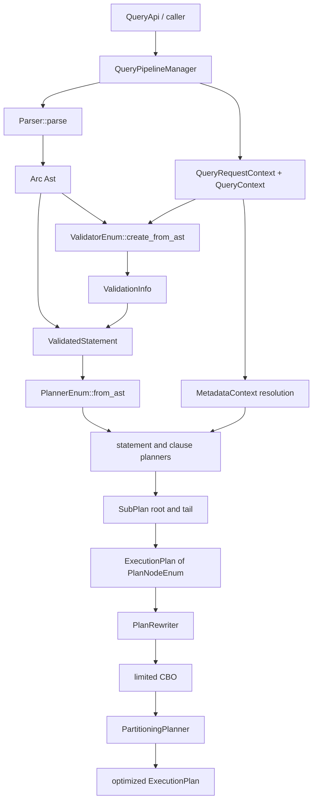
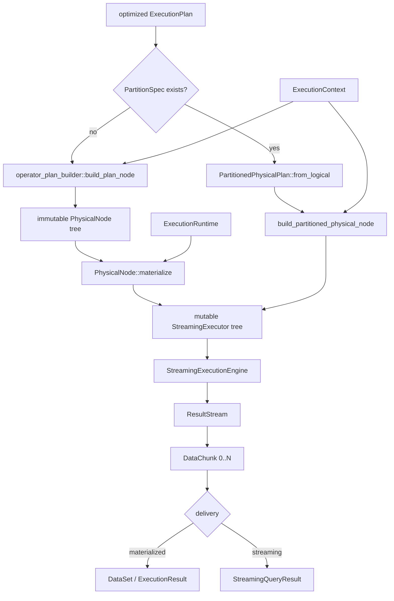
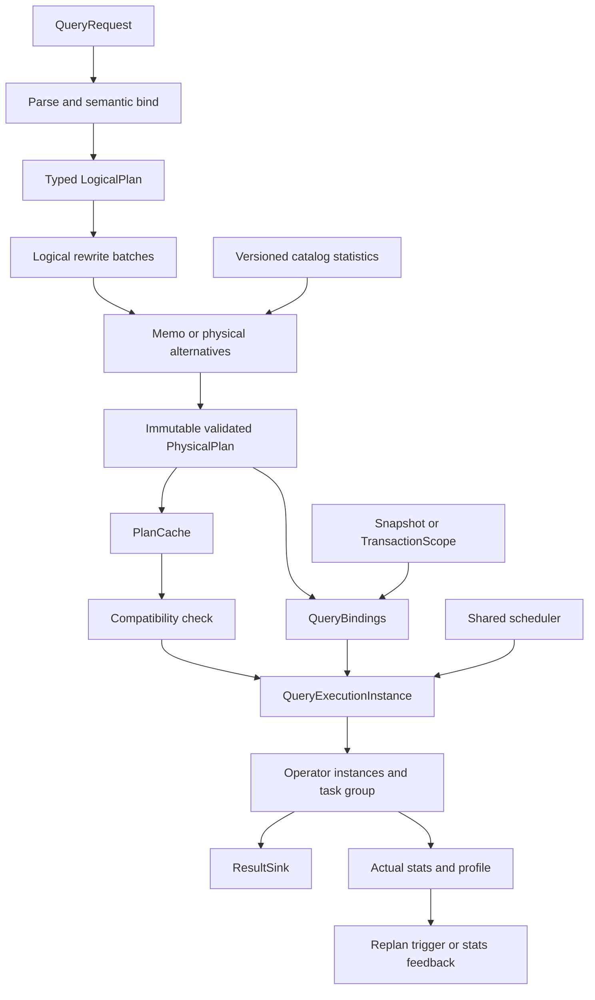

# Query 包 Plan、Optimizer 与 Executor 集成和数据流分析

> 分析日期：2026-07-14  
> 分析范围：`crates/graphdb-query` 当前代码，以及 `crates/graphdb-api` 对查询层的生产调用。  
> 说明：本文描述的是当前实际接线，不把尚未进入生产入口的类型或单元测试能力视为已上线能力。

## 1. 结论摘要

当前查询包已经形成了可运行的经典数据库处理主链：

```text
query text
  -> Parser / Ast
  -> Validator / ValidatedStatement
  -> statement planner / PlanNodeEnum tree
  -> heuristic rewrite
  -> limited cost-based rewrite
  -> optional partition selection
  -> PhysicalNode tree
  -> per-query StreamingExecutor tree
  -> pull-based DataChunk stream
  -> DataSet or StreamingQueryResult
```

整体方向是合理的，尤其是以下设计符合数据库内核常见实践：

- 解析、语义验证、规划、优化、执行分阶段；
- 可缓存的不可变算子配置与每次执行的可变算子状态分离；
- 使用 `open -> advance -> close` 的 pull 模型，并以 `DataChunk` 批量传输；
- 阻塞算子具有查询级内存预算，流式句柄具有取消和析构清理；
- 分区执行显式区分 local/global，并对 Aggregate、Distinct、TopN、Join 建立语义保持的 exchange 形状；
- planner 到 physical builder 使用枚举穷举分发，未支持节点可返回结构化错误。

但当前还不能认为 plan、optimizer、executor 已形成成熟数据库的闭环。核心原因不是模块数量不足，而是阶段契约和唯一事实来源尚未收敛：

1. `ExecutionPlan` 中的 `PlanNodeEnum` 同时混合逻辑操作、访问路径、物理 join 变体、DDL/DML 和分区属性，没有稳定的 Logical Plan 与 Physical Plan 分界。
2. optimizer 名义上包含完整的统计、代价和多种策略，生产 `apply_cost_based` 实际只注册 `TraversalDirectionOptimizer`，而且仅对根节点执行。
3. 该 traversal 策略忽略原始方向，可能把图查询语义上的方向当作可自由修改的物理属性，存在结果正确性风险。
4. executor 内已有两套物理计划表示：生产使用递归 `PhysicalNode`；新的 arena `PhysicalPlan`、validator 和 `QueryExecutionInstance` 尚未接入生产入口。
5. 多个查询入口各自复制 pipeline，导致 cache、metrics、request context、streaming 和 EXPLAIN/PROFILE 行为不一致。
6. 参数、事务、query id、KILL/cancellation、统计反馈和 cache invalidation 没有沿同一 execution binding 贯穿各阶段。

综合判断：这是一个“执行内核方向较好、优化器接线较弱、编译与运行契约仍在迁移”的开发中架构。适合继续演进，但应先收敛正确性和阶段边界，再扩展更多优化规则。

## 2. 模块角色与真实边界

| 层次 | 主要模块 | 输入 | 输出 | 当前职责 |
|---|---|---|---|---|
| API | `graphdb-api/api/core/query_api.rs` | query、space、params、session 语义 | `QueryResult` 或 stream | 构造请求并调用 pipeline |
| 编排 | `query_pipeline_manager.rs` | query text、`QueryRequestContext` | 执行结果 | 串联 parse、validate、plan、optimize、execute |
| 解析 | `parser/` | query text | `Arc<Ast>` | lexer/parser、表达式注册 |
| 验证 | `validator/` | `Ast`、`QueryContext`、schema | `ValidationInfo` | 类型、变量、子句、schema 和语义信息 |
| 规划 | `planning/` | `ValidatedStatement`、metadata、query context | `ExecutionPlan` | statement/clause planner 生成 `PlanNodeEnum` 树 |
| 优化 | `optimizer/` | `ExecutionPlan` | 改写后的 `ExecutionPlan` | 启发式规则、有限 CBO、分区选择 |
| 物理翻译 | `executor/streaming/operator_plan_builder/` | `PlanNodeEnum`、`ExecutionContext` | `PhysicalNode` | 生成不可变物理算子 spec 树 |
| 实例化 | `executor/streaming/plan/node.rs` | `PhysicalNode`、runtime、budget | `StreamingExecutor` | 为每次执行创建独立 mutable state |
| 驱动 | `executor/streaming/engine.rs` | executor tree | `ResultStream` | 驱动 open/advance/close、并行、清理 |
| 交付 | `stream.rs`、`stream_result.rs` | `DataChunk` | stream 或 `DataSet` | 背压式拉取、物化、取消、drop cleanup |

这里最容易混淆的两个名称是：

- `ExecutionPlan` 不是严格意义上的最终物理计划。它主要包装 `PlanNodeEnum` 根节点，同时附带 `PartitionSpec` 和 worker 配置。
- `PhysicalPlan` 不是当前生产路径使用的物理计划。生产路径当前使用的是递归 `PhysicalNode`；arena 形式的 `PhysicalPlan` 仍是迁移目标。

## 3. 生产入口与编排差异

### 3.1 API 的实际入口

`QueryApi::execute` 调用 `QueryPipelineManager::execute_query_with_request`，`QueryApi::execute_stream` 调用 `execute_query_stream_with_request`。这两条是 API 层的主要生产路径。

另外 pipeline 还提供：

- `execute_query_with_space`：包含 plan cache；
- `execute_query_with_profile`：包含分阶段 metrics/profile；
- `execute_query_with_streaming`：名称表示 streaming，但实际委托到物化路径；
- `execute_plan_to_stream`：真正返回 chunk stream；
- EXPLAIN/PROFILE 专用分支。

这些入口没有归一到一个内部 `compile` 和一个内部 `instantiate` 流程，实际差异如下：

| 能力 | `with_space` | `with_request` | `stream_with_request` | `with_profile` |
|---|---:|---:|---:|---:|
| parse/validate/plan/optimize | 是 | 是 | 是 | 是 |
| plan cache | 是 | 否 | 否 | 否 |
| streaming result | 否 | 否 | 是 | 否 |
| 分阶段 metrics/profile | 否 | 否 | 否 | 是 |
| request/session context | 自建最小 context | 外部传入 | 外部传入 | 仅 session id |
| EXPLAIN/PROFILE 分流 | 是 | 是 | 是，之后包装单 chunk | 是 |

这会造成同一 query 通过不同 API 执行时拥有不同的缓存、观测和生命周期语义，是目前集成层最明显的结构性问题。

### 3.2 普通查询的编译时数据流



关键数据对象的变化是：

1. parser 生成 `Ast`，表达式通过 `ExpressionAnalysisContext` 间接持有；
2. validator 不生成新 AST，而是输出 `ValidationInfo`，二者组成 `ValidatedStatement`；
3. planner 按 `Stmt` 枚举选择 `PlannerEnum`，各 statement planner 再调用 clause planner；
4. planner 通过嵌套 `PlanNodeEnum` 构建树，`SubPlan.root/tail` 用于组合片段；
5. optimizer 原地替换或重建该树；
6. `ExecutionPlan` 额外保存分区布局和执行并行参数。

### 3.3 执行时数据流



这里存在三次计划形态变化：

```text
PlanNodeEnum
  -> PhysicalNode
  -> StreamingExecutor
```

- `PlanNodeEnum` 保存 planner/optimizer 可读写的节点语义；
- `PhysicalNode` 保存不可变 operator spec 和物理 properties，不含 cursor、hash table 等运行状态；
- `StreamingExecutor` 为每次调用创建 cursor、buffer、hash table、lifecycle 和 profile 状态。

这一“spec 与 instance 分离”的思想是正确的，也为并发复用物理计划提供了基础。当前不足是 plan cache 仍缓存 `ExecutionPlan`，不是 executor 实际消费的 `PhysicalNode` 或目标 `PhysicalPlan`，因此每次 cache hit 仍要重新做物理翻译，且 cache、EXPLAIN 和 executor 并非共享同一物理事实来源。

## 4. Planner 的集成方式

### 4.1 planner 选择

`PlannerEnum::from_ast` 对 `Stmt` 做静态枚举分发，覆盖 MATCH、GO、LOOKUP、DML、DDL、全文和向量等语句。其优点是：

- 编译期穷举，避免字符串匹配；
- 不依赖运行时 planner registry；
- 各 planner 可共享统一 `Planner::transform` 契约。

代价是新增 statement 必须修改中心枚举和多个 match 分支。对内置查询语言而言这是可接受的，扩展性应通过清晰的 compiler interface 解决，而不是仅为了插件化引入动态分发。

### 4.2 metadata 的进入点

`QueryPipelineManager::build_metadata_context` 在规划前按 statement 类型预解析：

- MATCH：tag、edge type 和 space 内全部 index；
- fulltext/vector：指定 index；
- 部分 DDL：关联 schema；
- 其他语句通常不构造 metadata context。

MATCH planner 会利用 metadata 选择 `IndexScanNode`，否则回退 `ScanVerticesNode + Filter`。这体现了“语义验证后、执行前完成访问路径选择”的正确方向。

但 metadata 接口仍有几个边界问题：

- `build_metadata_context` 是按 `Stmt` 手工分支，metadata requirement 没有由 logical operator 声明；
- MATCH 会加载 space 内全部 index，而非只解析被引用对象；
- planner 创建 `IndexScanNode` 时把 `tag_id/index_id` 设为 0 并声明“稍后解析”，导致编译契约不闭合；
- schema/index version 没有进入统一的 plan compatibility 信息；
- 某些 metadata 失败只记录 warning 并继续 full scan，另一些失败立即报错，策略不统一。

### 4.3 `SubPlan` 和树形计划

planner 使用 `SubPlan { root, tail }` 组合复杂语句。实际执行依赖嵌套在父节点中的 child tree；`tail` 主要服务规划期连接。

当前 `SubPlan::merge` 和 `SegmentsConnector::add_input` 只组合 root/tail，并不总是显式修改节点输入。这种弱连接语义容易产生“规划器认为已连接，executor 看到的树却未连接”的风险。更稳妥的做法是让每次组合返回结构上已经闭合的 logical tree/DAG，或通过 arena node id 和明确 edge 表示连接。

### 4.4 示例：MATCH 查询

以概念查询为例：

```text
MATCH (p:Person)-[:KNOWS]->(f:Person)
WHERE p.age >= 18
RETURN f.name
ORDER BY f.name
LIMIT 10
```

当前典型规划过程为：

1. validator 记录 `Person`、`KNOWS`、变量和表达式语义；
2. pipeline 解析 tag/edge/index metadata；
3. MATCH planner 为首节点选择 `IndexScan` 或 `ScanVertices`；
4. 路径规划添加 `ExpandAll`；
5. WHERE planner 添加 `Filter`；
6. RETURN planner 添加 `Project`，聚合场景则生成 Project + Aggregate；
7. ORDER BY planner 添加 `Sort`；
8. pagination planner 添加 `Limit`；
9. heuristic rules 尝试 filter/project/limit 下推和 `Sort + Limit -> TopN`；
10. physical builder 生成 source、graph、unary/blocking operator spec；
11. runtime 从根 `Limit/TopN` 向下 pull chunk，达到 10 行后停止上游。

数据方向与调用方向相反：数据从 scan 流向 root，控制调用从 root 的 `advance()` 递归拉取 child。这正是 LIMIT 能提前终止 scan 的基础。

## 5. Optimizer 的实际工作方式

### 5.1 阶段顺序

`OptimizerEngine::optimize` 的实际顺序为：

```text
ExecutionPlan
  -> apply_heuristic
  -> apply_cost_based
  -> apply_partitioning_selection
  -> ExecutionPlan
```

#### 启发式阶段

默认 `RuleRegistry` 注册 49 条规则，覆盖：

- 冗余节点消除；
- filter/project/limit pushdown；
- project/filter 合并；
- join 简化、转换和重排；
- `Sort + Limit -> TopN`；
- aggregate filter pushdown。

`PlanRewriter` 先递归改写 child，再对当前节点循环执行全部规则，直到当前节点不再变化或达到上限。

其优势是实现直接、规则覆盖面广、静态分发清晰。当前需要注意：

- 收敛是“每个节点局部收敛”，不是 whole-plan batch 的反复固定点；
- 规则产生的新 child 不一定再次走完整的 child-first pipeline；
- `OptimizerEngine::max_heuristic_iterations` 与 `PlanRewriter::max_iterations` 是两个字段，setter 修改前者，但 `apply_heuristic` 没有把它传给 rewriter，配置实际不生效；
- 49 条规则是单一顺序列表，没有命名 batch、依赖关系、promise/priority 或循环检测指纹；
- `JoinReorder`、`IndexJoinSelection` 等被归为 heuristic，但其选择通常依赖 cardinality/cost，容易把“可证明等价的 rewrite”和“物理方案选择”混在一起。

#### 成本阶段

optimizer 目录中存在 `CostCalculator`、`CostAssigner`、`IndexSelector`、`JoinOrderOptimizer`、`AggregateStrategySelector`、`SortEliminationOptimizer`、`SubqueryUnnestingOptimizer`、feedback 等组件，但不能据此判断它们已经参与生产优化。

当前 `apply_cost_based` 的 `StrategyChain` 只加入：

```text
TraversalDirectionOptimizer
```

并且 `StrategyChain::apply` 只接收 `current_plan.root.clone()`，不会递归遍历子树。因此：

- 根不是 `Expand` 时，成本阶段基本是 no-op；
- 常见查询的根通常是 Project、Limit、Sort 或 Aggregate，内部 Expand 不会被处理；
- batch analysis 虽然生成并放入 `OptimizationContext`，当前唯一策略没有使用传入的 context；
- join order、index、aggregate、TopN、subquery 等 CBO 组件没有接入该 chain；
- `selectivity_feedback_manager` 和 CTE cache 不是这条优化主链的闭环反馈来源。

所以当前准确表述应是“具备较多 CBO 组件原型，生产 CBO 接线仅有根节点 traversal direction”，而不是“已有完整 cost-based optimizer”。

### 5.2 traversal direction 的正确性风险

`TraversalDirectionOptimizer::apply` 对根 `ExpandNode` 构造的 context 固定为：

```text
start_nodes = 1
explicit_direction = None
allow_bidirectional = true
steps = 1
```

随后直接调用 `expand_node.set_direction(...)`。这有两个问题：

1. 它没有读取 `ExpandNode::direction()`，因此会忽略用户查询中的 `OUT/IN/BOTH` 语义；
2. 图遍历方向通常不是可任意替换的物理属性。若要反向执行等价查询，必须同时交换起终点、变量绑定和路径输出语义。

在无统计时策略默认选择 Forward，也可能覆盖原始 In/Both。该风险虽然由于“只优化根节点”而不常触发，但一旦触发会影响结果正确性，应视为高优先级问题，而不是纯性能问题。

### 5.3 统计信息没有形成自动闭环

`OptimizerEngine` 自己持有 `optimizer::StatisticsManager`；pipeline 另外持有 core `StatsManager`，两者用途不同。代码中没有看到生产路径从 storage/schema 自动装载 tag、edge、property 统计到 optimizer manager，也没有看到执行完成后把 operator actual rows 回灌到该 manager。

因此默认 `OptimizerEngine::default()` 的优化统计通常为空。当前统计组件主要通过 builder 注入或测试手工更新。数据库最佳实践要求：

- catalog statistics 带 schema/space/version；
- ANALYZE 或后台任务更新 cardinality、NDV、histogram、degree distribution；
- 估算值随 plan node 保存，PROFILE 记录 actual/estimated 偏差；
- 反馈只用于触发 replan 或更新统计，不能无版本地污染共享状态。

## 6. Executor 的集成方式

### 6.1 logical-to-physical 翻译

`operator_plan_builder::build_plan_node` 对 `PlanNodeEnum` 做中心穷举分发，并按领域拆到 scans、relational、graph、writes、DDL、fulltext、vector、txn 等 builder。

这层的价值是把 planner node 与 runtime state 隔离，并能在执行前返回：

- unsupported node；
- missing required value；
- expression build error；
- capability unavailable。

这种 fail-fast builder 比运行时返回空结果更符合数据库正确性要求。当前 capability matrix 仍只是少量定向测试，不是对所有 enum variant、feature 组合和 planner 可生成形态的系统证明。

### 6.2 `PhysicalNode` 与 runtime state

`PhysicalNode` 仅包含：

- operator spec；
- child physical nodes；
- node id；
- `PhysicalProperties`。

`materialize` 才创建：

- cursor/current index；
- sort/aggregate/join state；
- memory tracker；
- storage/fulltext/vector handle；
- lifecycle 与 runtime 引用。

这是当前 executor 最符合最佳实践的部分：缓存对象不携带一次执行的可变状态，并发调用可以各自 materialize。

### 6.3 pull、chunk 与阻塞边界

`StreamingExecutionEngine` 驱动根 executor：

```text
open
  -> advance -> DataChunk
  -> advance -> DataChunk
  -> ...
  -> advance -> None
close
```

Filter、Project、Limit 等可保持 pipeline；Sort、Aggregate、部分 Join 等是 blocking operator。`ResultStream` 在首次 `next_chunk` 时 lazy open，耗尽、错误、显式 close 或 drop 都会清理资源。

该模型的优点包括自然背压、LIMIT 早停、客户端按 chunk 消费、无需为普通串行 pipeline 建立线程间队列。

当前 `DataChunk` 仍是 `Vec<Vec<Value>>` 的行式批处理，不是列向量执行。对轻量单节点图数据库这是合理的阶段选择，但不能把“chunk-at-a-time”描述成已经完成向量化；表达式求值、row clone 和动态 `Value` 仍会限制 CPU 效率。

### 6.4 分区和并行执行

partitioning 默认关闭，并且只有在以下条件满足时才选择布局：

- 显式开启；
- 有可信 vertex id range；
- 恰好一个带 tag 的 vertex scan；
- 无 write、transaction boundary、graph traversal；
- 统计量超过阈值。

这是保守且正确的默认策略。选中后：

- `PartitionedPhysicalPlan::from_logical` 标记 local/global split；
- local scan tree 按 range 克隆；
- global Sort/Limit/Window 和 binary operator 通过 Gather 保持全局语义；
- Aggregate、Distinct、TopN 使用两阶段或两层执行；
- hash join 可使用 repartition exchange；
- worker channel 有容量限制以提供 backpressure。

不足在于分区布局依赖静态配置范围，`layout_version` 目前为 `None`，且每个 query runtime 可能创建自己的 worker pool，缺少实例级全局调度、公平性和 admission control。

### 6.5 目标 `PhysicalPlan` 尚未接入

`executor/streaming/plan` 已定义 arena `PhysicalPlan`、fragment graph、output contract、compatibility 和 validator；`QueryExecutionInstance` 也定义了 bindings、sink、transaction scope 和唯一 runtime。

但当前生产 facade 没有调用它们。`QueryExecutionInstance::instantiate` 仍同时要求 `PhysicalPlan` 和另一棵 `PhysicalNode`，注释也明确说明 arena 到 runtime operator 的 bridge 尚未完成。因此当前状态是：

```text
生产：ExecutionPlan -> PhysicalNode -> StreamingExecutor
目标：LogicalPlan -> PhysicalPlan -> QueryExecutionInstance
```

两套物理表示并存期间，properties、validator、cache、EXPLAIN 和实际运行形态容易漂移。应把完成 bridge 和删除双轨作为架构收敛任务，而不是长期保留两个同义计划层。

## 7. 跨阶段上下文和资源数据流

### 7.1 当前上下文转换

```text
QueryRequestContext
  -> QueryContext
  -> ValidatedStatement + MetadataContext
  -> ExecutionPlan
  -> newly-created ExecutionContext
  -> ExecutionRuntime
```

`QueryPipelineManager::execute_plan` 重新创建默认 `ExecutionContext`，当前主要复制 storage、space name、fulltext/vector manager 和并行配置。以下信息没有完整贯穿：

- `QueryRequestContext.parameters` 没有复制到 `ExecutionContext.parameters`；
- API `execute_with_params` 构造了含参数的 `QueryRequest`，但 `QueryApi::execute` 又创建不含参数的 `QueryRequestContext`；
- request/session/user 信息没有写入 runtime identity；
- `ExecutionContext.query_id` 保持默认 0；
- `QueryContext::mark_killed` 与 `ExecutionRuntime` cancel token 是两套状态；
- transaction id/auto-commit 没有进入统一 `TransactionScope`；
- expression context 默认重新创建，而非明确绑定当前 validated AST 的 context。

这说明 `QueryContext` 注释中“visible to parser, planner, optimizer, executor”的目标尚未真正实现。最佳实践不是让一个巨型 context 被所有阶段任意访问，而是把 request-scoped immutable bindings 显式投影到各阶段需要的 typed context，并保证关键 identity/parameter/transaction/cancellation 来源唯一。

### 7.2 storage 边界

执行上下文把 storage 保存为：

```text
Arc<RwLock<dyn StorageClient>>
```

优点是 executor 与具体 storage 类型解耦；问题是所有算子共享同一个外层锁，是否能并发取决于每个 operator 持锁范围。成熟设计更常见的是：

- storage client 自身提供线程安全 snapshot/read transaction；
- query binding 持有同一个 snapshot/transaction handle；
- cursor 只借用或持有该 handle，而不是每个 next 都竞争数据库级锁；
- DML 与外部全文/向量同步共享明确提交协议。

## 8. Plan Cache、EXPLAIN 与观测链路

### 8.1 plan cache

cache 当前保存优化后的 `ExecutionPlan`，普通 key 仅包含完整 query text。存在以下集成问题：

- key 不包含 space、schema version、index version、feature set、authorization 或 parameter type；
- `execute_query_with_space` 才使用 cache，API 主要生产入口 `with_request` 不使用；
- pipeline 调用 `put` 时没有填充 `dependent_tables`；
- `InvalidationManager`/`CacheManager` 存在，但没有接到 `QueryPipelineManager` 和 DDL/DML 事件；
- 带 `PartitionSpec` 的计划使用 fingerprint key 写入，但普通 `get(query)` 总以 `fingerprint=None` 查询，因此分区计划实际上无法命中；
- fingerprint 只包含 source 和 `layout_version`，而当前自动布局 version 为 `None`；
- parameter handler 只记录位置，执行阶段没有完成 plan parameter binding。

对于 graph space 隔离的数据库，query text 单独作为 key 可能复用另一个 space 生成的访问路径。即使当前 API 主入口绕过了 cache，这仍是接口级正确性风险。

推荐 key 至少包含：

```text
normalized query / prepared statement id
+ parameter type signature
+ space id
+ schema/index compatibility version
+ optimizer configuration version
+ relevant feature/collation/auth planning context
```

cache 应保存结构验证通过的唯一物理计划；每次执行只做 binding-dependent validation 和 instance materialization。

### 8.2 EXPLAIN/PROFILE

EXPLAIN 和 PROFILE 会重新验证 inner statement、重新规划并优化，然后使用专用 legacy-style `BaseExecutor` 包装输出。它们能描述 `PlanNodeEnum` 并读取部分 streaming runtime profile。

当前差异包括：

- EXPLAIN 展示的是优化后的 `ExecutionPlan`，不一定是最终 `PhysicalNode`/exchange/runtime 形态；
- PROFILE 通过 streaming executor 执行，但 stats context 主要记录 root 汇总，operator 明细来自另一套 runtime profile；
- `execute_explain_analyze` 存在，但主路由对所有 `ExplainStmt` 调用的是 PlanOnly `execute_explain`，代码中没有其他调用点；
- EXPLAIN/PROFILE 又各自创建 execution context，可能继续丢失参数、space、transaction 等 binding。

数据库最佳实践要求 EXPLAIN 的事实来源就是 executor 将要实例化的 physical plan；EXPLAIN ANALYZE 在同一 physical node id 上叠加 actual rows、loops、time、memory、spill 和 parallel task 指标。

## 9. 最佳实践符合度评估

| 维度 | 评价 | 依据 |
|---|---|---|
| 分阶段 compiler pipeline | 较好 | parse/validate/plan/optimize/execute 分层明确 |
| semantic validation | 较好 | `ValidatedStatement` 携带语义信息，planner 不直接消费裸文本 |
| logical/physical plan 分离 | 较弱 | `PlanNodeEnum` 混合逻辑与物理选择，且物理表示双轨 |
| optimizer 完整性 | 较弱 | 49 条 heuristic；生产 CBO 仅根 traversal strategy |
| cost/statistics 闭环 | 不足 | 默认统计来源和执行反馈未接通 |
| immutable plan / mutable instance | 较好 | `PhysicalNode::materialize` 每次创建独立 state |
| streaming/backpressure | 较好 | pull chunk、bounded partition channel、early stop |
| global relational semantics | 中上 | 分区 Aggregate/Distinct/TopN/Join 有显式 global phase |
| plan validation | 迁移中 | structured build error 已用；arena validator 未进生产且多项为骨架 |
| cache correctness | 不足 | key/context/invalidation 不闭合，生产入口不统一 |
| transaction/snapshot | 不足 | `TransactionScope` 未进入 production query instance |
| cancellation/query lifecycle | 不足 | runtime 有能力，但 query id/KILL/context 未统一 |
| observability | 中等 | phase metrics 和 operator profile 均存在，但入口和 id 不统一 |
| resource governance | 中等偏弱 | query budget 有基础；spill/global scheduler/admission 未闭环 |
| extensibility/maintainability | 中等 | enum 分发类型安全，但重复 match 和多套表示维护成本高 |
| correctness gates | 中等偏弱 | 局部测试多，缺全量 planner-to-executor capability/differential gate |

## 10. 问题优先级

### 10.1 P0：结果或隔离正确性

1. 停止 traversal optimizer 直接覆盖语义方向；在能证明等价反向执行前，只允许保留原方向。
2. 参数必须从 API request 进入 `QueryRequestContext`、typed binding、runtime expression frame；缺参或类型不符在实例化前报错。
3. transaction/snapshot 必须成为 scan、traversal、DML、全文和向量操作的统一 binding。
4. plan cache key 必须包含 space 和 schema/index compatibility；未接入 invalidation 前，DDL 后不能继续复用旧访问路径。
5. 建立所有 planner 可生成节点到 physical builder 的能力闭包，未实现必须 build-time error，不能表现为合法零行。

### 10.2 P1：架构收敛

1. 引入明确的 `LogicalPlan`，只表达关系/图语义和 logical schema。
2. 让 optimizer 输出唯一 `PhysicalPlan`，在该层完成 access path、join algorithm、distribution、ordering、memory policy 和 output contract。
3. 完成 arena `PhysicalPlan -> StreamingExecutor` bridge，使 `QueryExecutionInstance` 成为唯一生产实例化入口。
4. 删除或降级 `ExecutionPlan`、`PartitionedPhysicalPlan`、`PhysicalNode` 中重复表达的物理事实，避免双向同步。
5. 将 pipeline 重构为共享的 `compile(request) -> Arc<PhysicalPlan>` 与 `execute(plan, bindings, sink)`；所有 API 入口只选择 sink 和 telemetry policy。
6. EXPLAIN、PROFILE、cache 和 executor 统一使用 physical operator id 和同一 plan。

### 10.3 P1：optimizer 闭环

1. 把 rewrite rules 分成命名 batch，例如 normalize、predicate pushdown、projection pruning、decorrelation、physical conversion、cleanup。
2. 修复 max iteration 配置接线，并为规则循环使用 plan fingerprint 检测。
3. 区分等价 rewrite 与 cost-based choice；join reorder/index/aggregate algorithm 不应伪装成必然更优的 heuristic。
4. strategy 应递归或基于 memo/group 应用于全计划，而非只处理 root。
5. 先接入少而可信的 CBO：cardinality propagation、scan/index choice、两表 join algorithm，再扩展 join order和图遍历起点。
6. 每个 physical choice 保存 estimated rows/cost/reason，供 EXPLAIN 与回归测试检查。

### 10.4 P2：性能和工程治理

1. 由数据库实例持有共享 scheduler，query 只创建 task group 和 quota，避免每查询线程池。
2. 将静态 ID range partition 演进为 storage cursor range/page/index segment morsel，并带 layout version。
3. 完成一种 spill 算法的写出、重读、合并和错误清理闭环，再声明对应算子 spillable。
4. 根据 profile 决定是否从 row-oriented chunk 演进到 typed column vector；不要只改变容器名称。
5. 减少 `PlanNodeEnum` children/name/visitor 等重复 match，通过单一宏或生成式 schema 保证新增节点时编译失败。

## 11. 推荐目标数据流



目标阶段契约建议如下：

| 阶段 | 必须成立的不变量 |
|---|---|
| semantic bind 完成 | 所有变量、属性、函数、参数类型和权限对象已解析 |
| LogicalPlan 完成 | logical schema 明确；不含 runtime handle 和 mutable state |
| PhysicalPlan 完成 | access path、algorithm、distribution、ordering、memory policy 已选择 |
| cache write 前 | structural validation 通过，compatibility version 完整 |
| instantiate 前 | 参数、权限、schema version、snapshot/transaction、resource quota 有效 |
| execute 期间 | query id、cancel token、deadline、memory pool、task group 来源唯一 |
| close 完成 | task 停止、operator close、transaction finalize、资源释放、registry 注销 |

## 12. 建议的验证门禁

### 12.1 编译契约测试

- 遍历每个 `Stmt` 的 representative AST，验证 validator 和 planner 都可处理或明确拒绝；
- 遍历 planner 可生成的每个 `PlanNodeEnum` shape，验证 physical builder 支持或返回预期 capability error；
- 验证每个 physical operator 的 input arity、schema、slot、ordering、distribution 和 memory policy；
- 验证 plan clone/rewrite 后 logical node id 稳定且唯一。

最后一点尤其重要：部分 node 使用 derive `Clone` 保留 id，而 `ExpandAllNode` 的手写 `Clone` 会分配新 id。当前 clone 语义不一致，会影响 rewrite context、EXPLAIN/PROFILE 对齐和 cache fingerprint。

### 12.2 差分测试

- optimized 与 optimizer disabled 结果一致；
- streaming collect 与 materialized 结果一致；
- serial 与 partition/parallel 结果一致；
- full scan 与 index scan 结果一致；
- 原方向计划与任何反向物理执行方案结果一致；
- cache miss 与 hit 在不同 space/schema version 下符合预期。

### 12.3 故障与生命周期测试

- parse/validate/plan/build/open/next/close 每阶段注入错误；
- client disconnect、KILL、deadline、worker error、重复 close；
- memory exceeded、spill disk full/corruption；
- transaction commit/rollback/savepoint 和外部索引同步失败；
- schema/index 在 compile 与 instantiate 之间变化；
- 空结果仍返回正确 output schema。

## 13. 最终判断

当前设计并非需要推倒重来。值得保留的主干是：

- typed AST + validation info；
- enum-based built-in operator dispatch；
- immutable `PhysicalNode` spec 与 mutable executor instance 分离；
- pull-based chunk executor；
- conservative partition semantics；
- runtime cancellation、profile 和 teardown 基础。

最需要改变的是“多个半重叠计划层和入口各自接线”的状态。项目应把下一阶段目标定义为：以唯一、验证通过、可缓存的 `PhysicalPlan` 为中心，使 optimizer、EXPLAIN、cache、execution bindings 和 runtime lifecycle 全部围绕同一对象闭环。完成这一收敛后，再扩展统计和 CBO 才能获得可靠收益；否则新增规则越多，计划与实际执行漂移的风险越大。

## 14. 主要代码依据

- pipeline 编排：`crates/graphdb-query/src/query/query_pipeline_manager.rs`
- API 生产入口：`crates/graphdb-api/src/api/core/query_api.rs`
- planner 分发：`crates/graphdb-query/src/query/planning/planner.rs`
- MATCH 规划：`crates/graphdb-query/src/query/planning/statements/match_statement_planner.rs`
- plan 数据结构：`crates/graphdb-query/src/query/planning/plan/execution_plan.rs`
- plan node 枚举/children：`crates/graphdb-query/src/query/planning/plan/core/nodes/base/`
- optimizer 主链：`crates/graphdb-query/src/query/optimizer/engine.rs`
- heuristic rewriter：`crates/graphdb-query/src/query/optimizer/heuristic/plan_rewriter.rs`
- CBO strategy chain：`crates/graphdb-query/src/query/optimizer/cost_based/trait_def.rs`
- traversal direction：`crates/graphdb-query/src/query/optimizer/cost_based/traversal_direction.rs`
- partition selection：`crates/graphdb-query/src/query/optimizer/partitioning.rs`
- logical-to-physical builder：`crates/graphdb-query/src/query/executor/streaming/operator_plan_builder/`
- immutable physical spec：`crates/graphdb-query/src/query/executor/streaming/plan/node.rs`
- executor/engine/stream：`crates/graphdb-query/src/query/executor/streaming/{executor,engine,stream,stream_result}.rs`
- 目标 arena plan 和 validator：`crates/graphdb-query/src/query/executor/streaming/plan/`
- 目标 execution instance：`crates/graphdb-query/src/query/executor/streaming/instance.rs`
- plan cache：`crates/graphdb-query/src/query/cache/plan_cache.rs`
