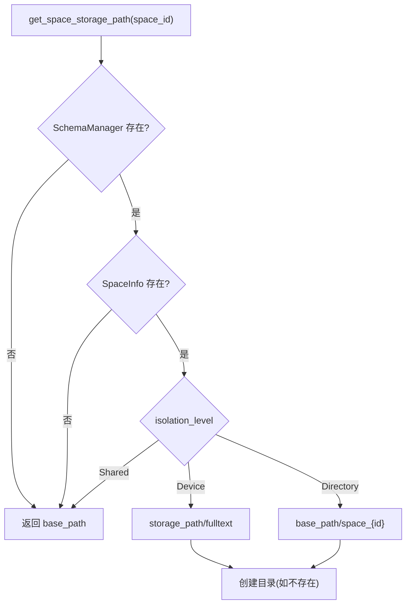

## 1. 高层摘要 (TL;DR)

- **影响:** 🟠 **高** - 引入了空间存储隔离机制,重构了全文索引和向量索引的命名规范,并增强了索引生命周期管理
- **核心变更:**
  - ✨ 新增 `IsolationLevel` 枚举,支持共享存储、独立子目录和独立设备三种隔离级别
  - 📦 `SpaceInfo` 新增 `storage_path` 和 `isolation_level` 字段,支持自定义存储路径
  - 🔍 全文索引管理器新增空间/标签验证逻辑和 `drop_space_indexes` 方法
  - 🏷️ 统一索引命名规范,添加 `space_ft` 和 `space_vec` 前缀

## 2. 可视化概览 (代码与逻辑映射)

```mermaid
graph TD
    subgraph "业务目标: 空间存储隔离"
        A[创建空间] --> B[设置隔离级别]
        B --> C{选择隔离级别}
        C -->|Shared| D[共享基础路径]
        C -->|Directory| E[独立子目录<br/>space_{id}]
        C -->|Device| F[自定义存储路径]
    end

    subgraph "核心类型: src/core/types/space.rs"
        G["IsolationLevel 枚举"]
        H["SpaceInfo 结构体<br/>+storage_path<br/>+isolation_level"]
        I["with_storage_path()"]
        J["with_isolation_level()"]
    end

    subgraph "索引管理: src/search/manager.rs"
        K["validate_space_exists()"]
        L["validate_tag_exists()"]
        M["get_space_storage_path()"]
        N["create_index()"]
        O["drop_space_indexes()"]
    end

    subgraph "错误处理: src/search/error.rs"
        P["SpaceNotFound"]
        Q["TagNotFound"]
        R["FieldNotFound"]
    end

    A --> G
    B --> H
    H --> I
    H --> J
    N --> K
    N --> L
    N --> M
    M --> C
    K --> P
    L --> Q
    N --> R
    O --> F
```

## 3. 详细变更分析

### 🏗️ 核心类型变更

#### **组件: 空间类型系统** (`src/core/types/space.rs`)

**变更说明:**

- 新增 `IsolationLevel` 枚举,定义三种存储隔离级别
- 扩展 `SpaceInfo` 结构体,支持自定义存储路径配置
- 新增 Builder 模式方法,便于链式调用配置

**代码结构:**

| 类型/方法                   | 说明             | 新增/修改 |
| --------------------------- | ---------------- | --------- |
| `IsolationLevel`            | 存储隔离级别枚举 | ✨ 新增   |
| `SpaceInfo.storage_path`    | 自定义存储路径   | ✨ 新增   |
| `SpaceInfo.isolation_level` | 隔离级别字段     | ✨ 新增   |
| `with_storage_path()`       | 设置存储路径     | ✨ 新增   |
| `with_isolation_level()`    | 设置隔离级别     | ✨ 新增   |

**隔离级别配置表:**

| 隔离级别        | 存储路径规则           | 适用场景       |
| --------------- | ---------------------- | -------------- |
| `Shared` (默认) | 所有空间共享基础路径   | 多租户共享存储 |
| `Directory`     | `base_path/space_{id}` | 独立子目录隔离 |
| `Device`        | 自定义 `storage_path`  | 独立存储设备   |

### 🔍 索引管理器增强

#### **组件: 全文索引管理器** (`src/search/manager.rs`)

**变更说明:**

- 集成 `SchemaManager`,支持空间元数据验证
- 新增空间和标签存在性验证逻辑
- 根据隔离级别动态计算索引存储路径
- 新增空间级索引清理方法

**新增方法:**

| 方法名                     | 功能               | 调用时机      |
| -------------------------- | ------------------ | ------------- |
| `with_schema_manager()`    | 注入 SchemaManager | 初始化配置    |
| `validate_space_exists()`  | 验证空间存在性     | 创建索引前    |
| `validate_tag_exists()`    | 验证标签存在性     | 创建索引前    |
| `get_space_storage_path()` | 获取空间存储路径   | 创建/删除索引 |
| `drop_space_indexes()`     | 删除空间所有索引   | 删除空间时    |

**存储路径决策逻辑:**



### 🏷️ 索引命名规范统一

#### **组件: 索引元数据** (`src/search/metadata.rs`, `src/sync/vector_sync.rs`)

**变更说明:**

- 全文索引 ID 添加 `space_ft` 前缀
- 向量索引集合名添加 `space_vec` 前缀
- 提高索引可识别性,避免命名冲突

**命名规范变更表:**

| 索引类型 | 旧格式                           | 新格式                               | 示例                         |
| -------- | -------------------------------- | ------------------------------------ | ---------------------------- |
| 全文索引 | `{space_id}_{tag}_{field}`       | `space_ft_{space_id}_{tag}_{field}`  | `space_ft_1_user_name`       |
| 向量索引 | `space_{space_id}_{tag}_{field}` | `space_vec_{space_id}_{tag}_{field}` | `space_vec_1_user_embedding` |

### ⚠️ 错误处理增强

#### **组件: 搜索错误类型** (`src/search/error.rs`, `src/core/error/fulltext.rs`)

**新增错误变体:**

| 错误类型        | 参数     | 转换目标                  | 触发场景   |
| --------------- | -------- | ------------------------- | ---------- |
| `SpaceNotFound` | `u64`    | `FulltextError::Internal` | 空间不存在 |
| `TagNotFound`   | `String` | `FulltextError::Internal` | 标签不存在 |
| `FieldNotFound` | `String` | `FulltextError::Internal` | 字段不存在 |

### 🧪 测试代码更新

**受影响的测试文件:**

- `src/query/executor/admin/space/create_space.rs`
- `src/query/metadata/schema_provider.rs`
- `src/query/query_context_builder.rs`

**变更内容:**
所有测试中的 `SpaceInfo` 构造均添加了新字段的默认值:

```rust
SpaceInfo {
    // ... 原有字段
    storage_path: None,
    isolation_level: IsolationLevel::default(),
}
```

### ✅ 测试建议

**功能测试:**

1.  **空间创建测试**
    - 验证三种隔离级别的空间创建
    - 测试自定义存储路径配置
    - 验证默认值正确性

2.  **索引创建测试**
    - 测试在共享/目录/设备隔离级别下创建索引
    - 验证空间不存在时的错误处理
    - 验证标签不存在时的错误处理
    - 检查索引存储路径是否正确

3.  **索引删除测试**
    - 测试 `drop_space_indexes` 方法
    - 验证索引文件和元数据清理
    - 测试自定义路径下的索引删除

4.  **命名规范测试**
    - 验证全文索引 ID 格式: `space_ft_{space_id}_{tag}_{field}`
    - 验证向量集合名格式: `space_vec_{space_id}_{tag}_{field}`

**边界测试:**

- 空间 ID 为 0 的情况
- 标签名称包含特殊字符
- 自定义路径不存在时的自动创建
- 并发创建同一空间索引
